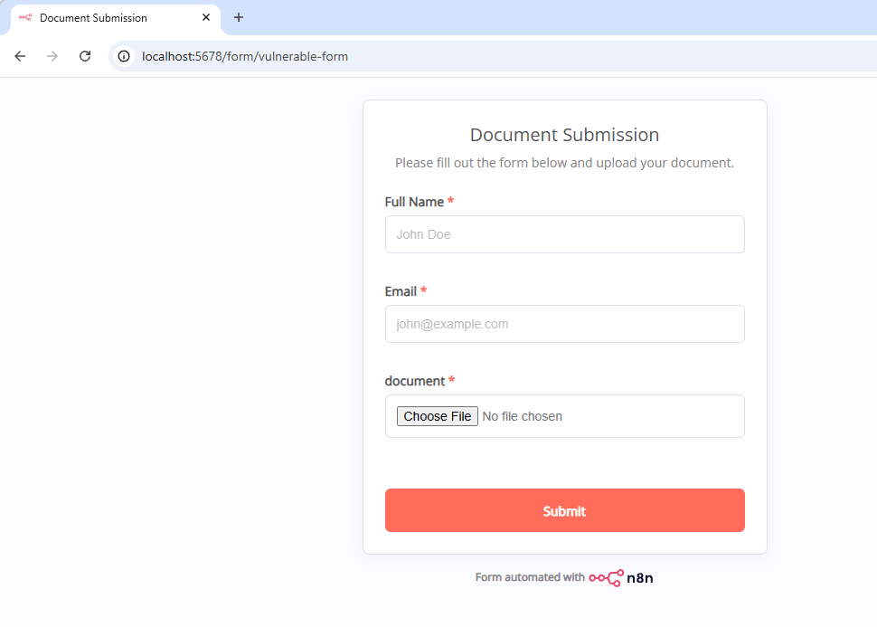
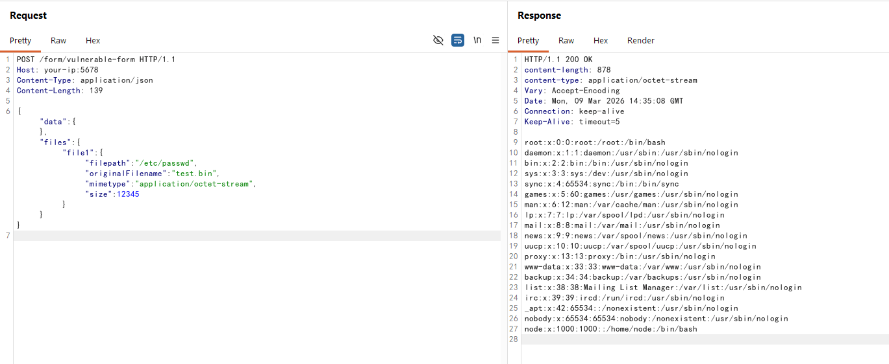

# n8n Content-Type Confusion Arbitrary File Read to RCE (CVE-2026-21858)

[中文版本(Chinese version)](README.zh-cn.md)

[n8n](https://n8n.io/) is an open-source workflow automation platform that allows users to connect various services through a visual node-based interface.

CVE-2026-21858 (nicknamed "Ni8mare") is a critical vulnerability (CVSS 10.0) in n8n affecting versions 1.65.0 through 1.120.x. The vulnerability exists in how n8n handles incoming HTTP requests to Form Webhook endpoints. The `formWebhook()` function invokes `prepareFormReturnItem()` and `copyBinaryFile()` without first verifying that the request's `Content-Type` is `multipart/form-data`. By sending a JSON request instead of a multipart form, an attacker can directly control the `filepath` property in `req.body.files`, causing n8n to read and return arbitrary files from the server filesystem. This unauthenticated arbitrary file read can be chained with session cookie forgery and expression injection (CVE-2025-68613) to achieve full remote code execution.

References:

- <https://www.cyera.com/research-labs/ni8mare-unauthenticated-remote-code-execution-in-n8n-cve-2026-21858>
- <https://github.com/Chocapikk/CVE-2026-21858>
- <https://github.com/n8n-io/n8n/security/advisories/GHSA-v4pr-fm98-w9pg>

## Environment Setup

Execute the following command to start n8n 1.65.0:

```
docker compose up -d
```

After the server starts (initialization takes about 30 seconds), visit `http://your-ip:5678` to access the n8n interface. The environment is pre-configured with an admin account (`admin@vulhub.org:Vulhub123`) and a document submission workflow with file upload enabled, accessible at `/form/vulnerable-form`.

## Vulnerability Reproduction

The vulnerability exploits a Content-Type confusion in n8n's Form Webhook handler. When a form endpoint expects `multipart/form-data` file uploads, the server processes `req.body.files` without validating the Content-Type header. By sending `application/json` instead, the attacker can inject a crafted `files` object with an arbitrary `filepath`, and the server will read and return the file contents.

Exploiting this vulnerability requires knowing the path of an active Form endpoint. In this environment, visiting `http://your-ip:5678/form/vulnerable-form` reveals a document submission form with file upload functionality, confirming the endpoint exists and is active.



Then send the following request to the same endpoint, replacing the expected `multipart/form-data` Content-Type with `application/json` and injecting an arbitrary file path to read `/etc/passwd` from the server:

```
POST /form/vulnerable-form HTTP/1.1
Host: your-ip:5678
Content-Type: application/json

{"data":{},"files":{"file1":{"filepath":"/etc/passwd","originalFilename":"test.bin","mimetype":"application/octet-stream","size":12345}}}
```



The server responds with the contents of `/etc/passwd`, confirming the arbitrary file read vulnerability. An attacker can use this primitive to read the n8n database at `/home/node/.n8n/database.sqlite` and the config file at `/home/node/.n8n/config` to extract admin credentials and the encryption key, then forge a valid admin session cookie and achieve remote code execution through expression injection in workflow nodes.
