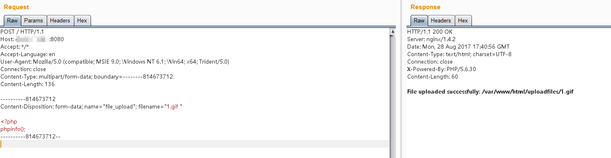
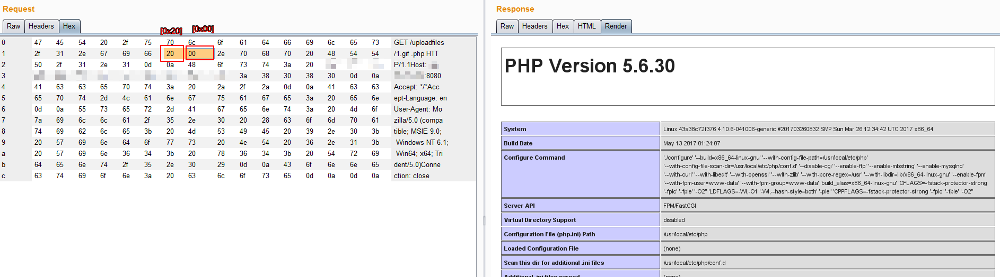

# Nginx 文件名逻辑漏洞（CVE-2013-4547）

影响版本：Nginx 0.8.41 ~ 1.4.3 / 1.5.0 ~ 1.5.7

参考链接：

 - http://cve.mitre.org/cgi-bin/cvename.cgi?name=CVE-2013-4547
 - https://blog.werner.wiki/file-resolution-vulnerability-nginx/
 - http://www.91ri.org/9064.html

## 漏洞原理

这个漏洞其实和代码执行没有太大关系，其主要原因是错误地解析了请求的URI，错误地获取到用户请求的文件名，导致出现权限绕过、代码执行的连带影响。

举个例子，比如，Nginx匹配到.php结尾的请求，就发送给fastcgi进行解析，常见的写法如下：

```
location ~ \.php$ {
    include        fastcgi_params;

    fastcgi_pass   127.0.0.1:9000;
    fastcgi_index  index.php;
    fastcgi_param  SCRIPT_FILENAME  /var/www/html$fastcgi_script_name;
    fastcgi_param  DOCUMENT_ROOT /var/www/html;
}
```

正常情况下（关闭pathinfo的情况下），只有.php后缀的文件才会被发送给fastcgi解析。

而存在CVE-2013-4547的情况下，我们请求`1.gif[0x20][0x00].php`，这个URI可以匹配上正则`\.php$`，可以进入这个Location块；但进入后，Nginx却错误地认为请求的文件是`1.gif[0x20]`，就设置其为`SCRIPT_FILENAME`的值发送给fastcgi。

fastcgi根据`SCRIPT_FILENAME`的值进行解析，最后造成了解析漏洞。

所以，我们只需要上传一个空格结尾的文件，即可使PHP解析之。

再举个例子，比如很多网站限制了允许访问后台的IP：

```
location /admin/ {
    allow 127.0.0.1;
    deny all;
}
```

我们可以请求如下URI：`/test[0x20]/../admin/index.php`，这个URI不会匹配上location后面的`/admin/`，也就绕过了其中的IP验证；但最后请求的是`/test[0x20]/../admin/index.php`文件，也就是`/admin/index.php`，成功访问到后台。（这个前提是需要有一个目录叫“test ”：这是Linux系统的特点，如果有一个不存在的目录，则即使跳转到上一层，也会爆文件不存在的错误，Windows下没有这个限制）

## 漏洞复现

启动漏洞环境：

```
docker-compose up -d
```

环境启动后，访问`http://your-ip:8080/`即可看到一个上传页面。

这个环境是黑名单验证，我们无法上传php后缀的文件，需要利用CVE-2013-4547。我们上传一个“1.gif ”，注意后面的空格：



访问`http://your-ip:8080/uploadfiles/1.gif[0x20][0x00].php`，即可发现PHP已被解析：



注意，[0x20]是空格，[0x00]是`\0`，这两个字符都不需要编码。
