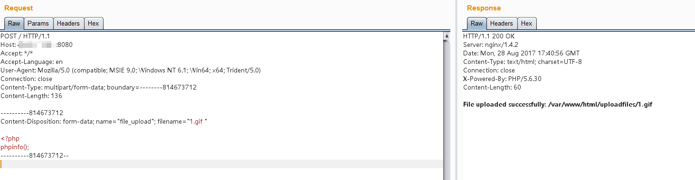
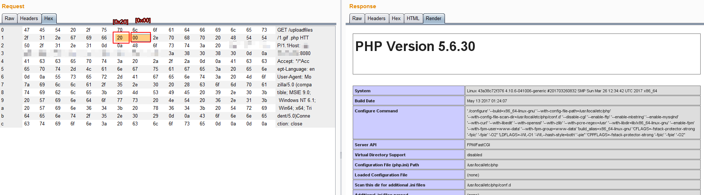

# Nginx 文件名逻辑漏洞（CVE-2013-4547）

Nginx 是一款 Web 服务器，可以作为反向代理、负载均衡、邮件代理、HTTP 缓存等。Nginx 0.8.41 到 1.4.3 和 1.5.x 之前的版本存在一个文件名解析漏洞，允许远程攻击者绕过一些特定的限制，执行原本不允许执行的文件。

这个漏洞的原理是，Nginx 错误地解析了请求的 URI，错误地获取到用户请求的文件名，导致出现权限绕过、代码执行等连带影响。

举个例子，比如，Nginx 匹配到.php 结尾的请求，就发送给 fastcgi 进行解析，常见的写法如下：

```
location ~ \.php$ {
    include        fastcgi_params;

    fastcgi_pass   127.0.0.1:9000;
    fastcgi_index  index.php;
    fastcgi_param  SCRIPT_FILENAME  /var/www/html$fastcgi_script_name;
    fastcgi_param  DOCUMENT_ROOT /var/www/html;
}
```

正常情况下（关闭 pathinfo 的情况下），只有.php 后缀的文件才会被发送给 fastcgi 解析。

而存在 CVE-2013-4547 的情况下，我们请求 `1.gif[0x20][0x00].php`，这个 URI 可以匹配上正则 `\.php$`，可以进入这个 Location 块；但进入后，Nginx 却错误地认为请求的文件是 `1.gif[0x20]`，就设置其为 `SCRIPT_FILENAME` 的值发送给 fastcgi。

fastcgi 根据 `SCRIPT_FILENAME` 的值进行解析，最后造成了解析漏洞。

所以，我们只需要上传一个空格结尾的文件，即可使 PHP 解析之。

再举个例子，比如很多网站限制了允许访问后台的 IP：

```
location /admin/ {
    allow 127.0.0.1;
    deny all;
}
```

我们可以请求如下 URI：`/test[0x20]/../admin/index.php`，这个 URI 不会匹配上 location 后面的 `/admin/`，也就绕过了其中的 IP 验证；但最后请求的是 `/test[0x20]/../admin/index.php` 文件，也就是 `/admin/index.php`，成功访问到后台。（这个前提是需要有一个目录叫"test "：这是 Linux 系统的特点，如果有一个不存在的目录，则即使跳转到上一层，也会爆文件不存在的错误，Windows 下没有这个限制）

参考链接：

 - http://cve.mitre.org/cgi-bin/cvename.cgi?name=CVE-2013-4547
 - https://blog.werner.wiki/file-resolution-vulnerability-nginx/
 - http://www.91ri.org/9064.html

## 漏洞环境

执行如下命令启动一个 Nginx 1.4.2 服务器：

```
docker compose up -d
```

环境启动后，访问 `http://your-ip:8080/` 即可看到一个上传页面。

## 漏洞复现

这个环境是黑名单验证，我们无法上传 php 后缀的文件，需要利用 CVE-2013-4547。我们上传一个"1.gif "，注意后面的空格：



访问 `http://your-ip:8080/uploadfiles/1.gif[0x20][0x00].php`，即可发现 PHP 已被解析：



注意，[0x20]是空格，[0x00]是 `\0`，这两个字符都不需要编码。
