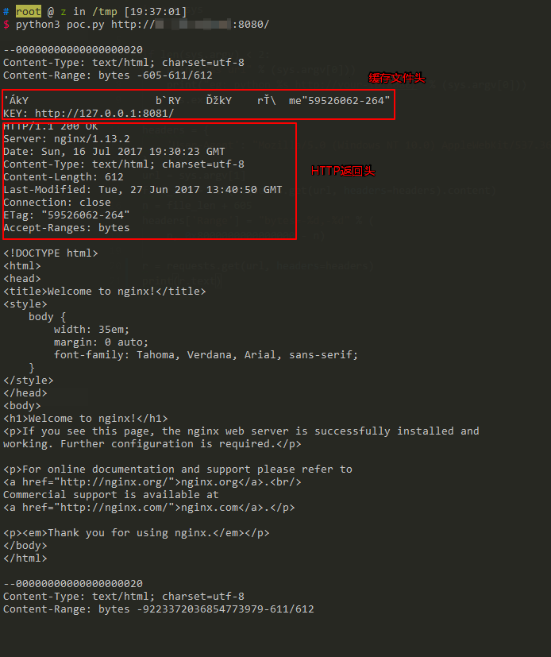

# Nginx 越界读取缓存漏洞（CVE-2017-7529）

Nginx 是一款 Web 服务器，可以作为反向代理、负载均衡、邮件代理、HTTP 缓存等。当 Nginx 作为反向代理时，通常会缓存一些文件，特别是静态文件。缓存的内容存储在文件中，每个缓存文件包括"文件头"+"HTTP 返回包头"+"HTTP 返回包体"。如果二次请求命中了该缓存文件，则 Nginx 会直接将该文件中的"HTTP 返回包体"返回给用户。

Nginx 版本从 0.5.6 到 1.13.2 的 nginx range filter 模块存在整数溢出漏洞，当遇到特殊构造的请求时，会导致泄露敏感信息。

如果请求中包含 Range 头，Nginx 会根据请求中提供的 start 和 end 位置，返回指定长度的内容。然而，如果 start 和 end 位置为负数，例如 (-600, -9223372036854774591)，则可能读取到负位置的数据。如果这次请求又命中了缓存文件，则可能就可以读取到缓存文件中位于"HTTP 返回包体"前的"文件头"、"HTTP 返回包头"等内容。

参考阅读：

 - https://cert.360.cn/detailnews.html?id=b879782fbad4a7f773b6c18490d67ac7
 - http://galaxylab.org/cve-2017-7529-nginx%E6%95%B4%E6%95%B0%E6%BA%A2%E5%87%BA%E6%BC%8F%E6%B4%9E%E5%88%86%E6%9E%90/

## 漏洞环境

执行如下命令启动一个 Nginx 1.13.2 服务器：

```
docker compose up -d
```

环境启动后，访问 `http://your-ip:8080/` 即可查看到 Nginx 默认页面，这个页面实际上是反向代理的 8081 端口的内容。

## 漏洞复现

调用 `python3 poc.py http://your-ip:8080/`，读取返回结果：



可见，越界读取到了位于"HTTP 返回包体"前的"文件头"、"HTTP 返回包头"等内容。

如果读取有误，请调整 poc.py 中的偏移地址（605）。
