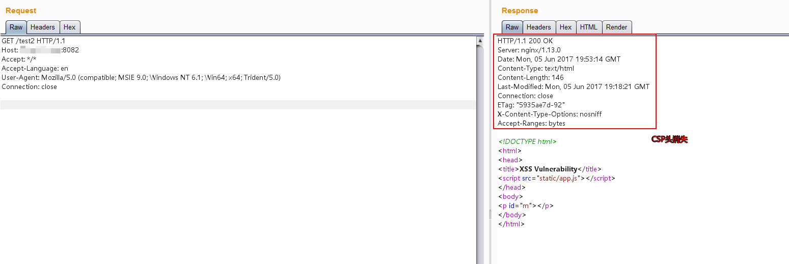

# Nginx 配置错误导致漏洞

## 运行测试环境

```
docker-compose up -d
```

运行成功后，Nginx将会监听8080/8081/8082三个端口，分别对应三种漏洞。

## Mistake 1. CRLF注入漏洞

Nginx会将`$uri`进行解码，导致传入%0a%0d即可引入换行符，造成CRLF注入漏洞。

错误的配置文件示例（原本的目的是为了让http的请求跳转到https上）：

```
location / {
    return 302 https://$host$uri;
}
```

Payload: `http://your-ip:8080/%0a%0dSet-Cookie:%20a=1`，可注入Set-Cookie头。

利用《[Bottle HTTP 头注入漏洞探究](https://www.leavesongs.com/PENETRATION/bottle-crlf-cve-2016-9964.html)》中的技巧，即可构造一个XSS漏洞：


## Mistake 2. 目录穿越漏洞

Nginx在配置别名（Alias）的时候，如果忘记加`/`，将造成一个目录穿越漏洞。

错误的配置文件示例（原本的目的是为了让用户访问到/home/目录下的文件）：

```
location /files {
    alias /home/;
}
```

Payload: `http://your-ip:8081/files../` ，成功穿越到根目录：


## Mistake 3. add_header被覆盖

Nginx配置文件子块（server、location、if）中的`add_header`，将会覆盖父块中的`add_header`添加的HTTP头，造成一些安全隐患。

如下列代码，整站（父块中）添加了CSP头：

```
add_header Content-Security-Policy "default-src 'self'";
add_header X-Frame-Options DENY;

location = /test1 {
    rewrite ^(.*)$ /xss.html break;
}

location = /test2 {
    add_header X-Content-Type-Options nosniff;
    rewrite ^(.*)$ /xss.html break;
}
```

但`/test2`的location中又添加了`X-Content-Type-Options`头，导致父块中的`add_header`全部失效：



XSS可被触发：


