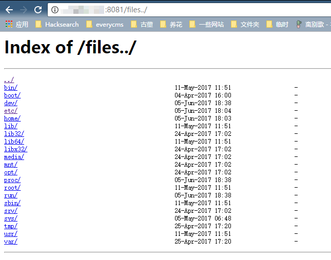

# Nginx Misconfiguration Vulnerabilities

[中文版本(Chinese version)](README.zh-cn.md)

Nginx is a web server that can be used as a reverse proxy, load balancer, mail proxy, and HTTP cache. This environment contains three vulnerabilities caused by Nginx misconfiguration.

## Environment Setup

Execute the following command to start a Nginx server with multiple vulnerabilities:

```
docker compose up -d
```

After successful execution, Nginx will listen on three ports: 8080/8081/8082, corresponding to three different vulnerabilities.

## Mistake 1. CRLF Injection Vulnerability

Nginx decodes `$uri`, which means inputting %0d%0a can introduce line breaks, leading to CRLF injection vulnerabilities.

Example of incorrect configuration (originally intended to redirect HTTP requests to HTTPS):

```
location / {
    return 302 https://$host$uri;
}
```

Payload: `http://your-ip:8080/%0d%0aSet-Cookie:%20a=1`, which can inject a Set-Cookie header.

  

Using techniques from the article "[Bottle HTTP Header Injection Vulnerability Analysis](https://www.leavesongs.com/PENETRATION/bottle-crlf-cve-2016-9964.html)", you can construct an XSS vulnerability:


## Mistake 2. Directory Traversal Vulnerability

When configuring aliases in Nginx, forgetting to add a `/` will create a directory traversal vulnerability.

Example of incorrect configuration (originally intended to allow users to access files in the /home/ directory):

```
location /files {
    alias /home/;
}
```

Payload: `http://your-ip:8081/files../`, successfully traversing to the root directory:



## Mistake 3. add_header Override

The `add_header` directive in Nginx configuration child blocks (server, location, if) will override HTTP headers added by `add_header` in the parent block, potentially creating security risks.

For example, in the following code, CSP headers are added site-wide (in the parent block):

```
add_header Content-Security-Policy "default-src 'self'";
add_header X-Frame-Options DENY;

location = /test1 {
    rewrite ^(.*)$ /xss.html break;
}

location = /test2 {
    add_header X-Content-Type-Options nosniff;
    rewrite ^(.*)$ /xss.html break;
}
```

However, because the `/test2` location block adds an `X-Content-Type-Options` header, all `add_header` directives in the parent block become ineffective:


XSS can be triggered:


