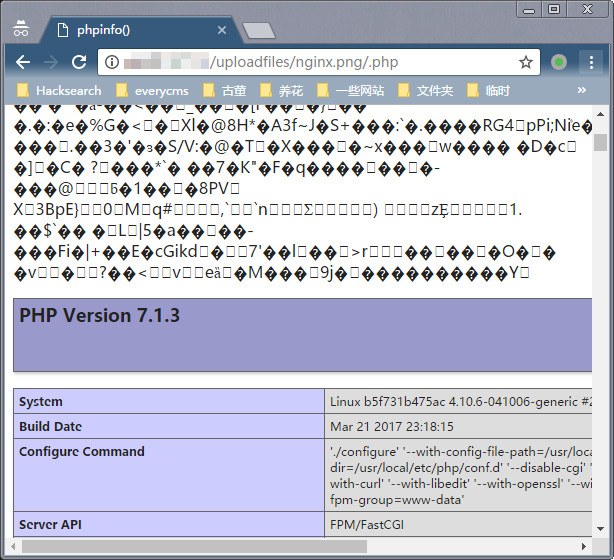
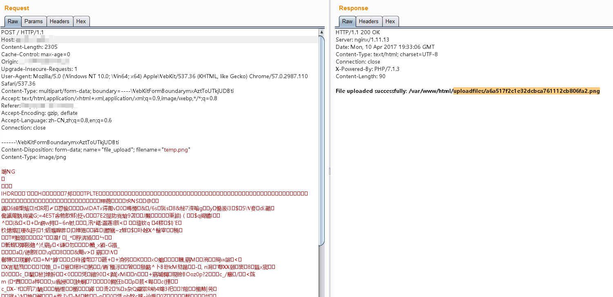
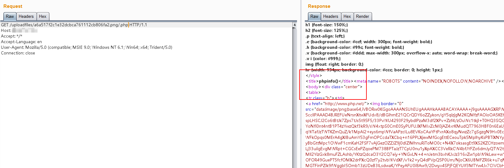

# Nginx Parsing Vulnerability

[中文版本(Chinese version)](README.zh-cn.md)

Nginx is a web server that can be used as a reverse proxy, load balancer, mail proxy, and HTTP cache. This environment contains a parsing vulnerability caused by improper user configuration.

Version information:

- Latest version of Nginx 1.x
- Latest version of PHP 7.1.x

This indicates that the vulnerability is not related to specific Nginx or PHP versions, but rather is caused by improper user configuration leading to parsing vulnerabilities.

The vulnerability exists because of how Nginx handles file extensions in its configuration. When a request is made to a file with multiple extensions (like `file.jpg.php`), Nginx may process it based on the last extension, even if the file was originally uploaded as an image.

This misconfiguration commonly occurs in the following Nginx configuration:

```nginx
location ~ \.php$ {
    fastcgi_pass   127.0.0.1:9000;
    fastcgi_index  index.php;
    fastcgi_param  SCRIPT_FILENAME  /var/www/html$fastcgi_script_name;
    include        fastcgi_params;
}
```

When a request is made to `file.jpg/.php`, Nginx will treat it as a PHP file and send it to the PHP-FPM for processing, even though it's actually an image file. This behavior can be exploited to execute malicious code that was uploaded as an image file.

## Environment Setup

Execute the following command to start a Nginx server with a parsing vulnerability:

```
docker compose up -d
```

After successful execution, the Nginx server will listen on port 80.

## Vulnerability Reproduce

Visit `http://your-ip/uploadfiles/nginx.png` and `http://your-ip/uploadfiles/nginx.png/.php` to see the effect.

Normal display:


After adding the `/.php` suffix, the file is parsed as a PHP file:



Visit `http://your-ip/index.php` to test the upload functionality. While the upload code itself has no vulnerabilities, you can get a shell by exploiting the parsing vulnerability:





To prevent this vulnerability:

1. Configure proper file extension handling in Nginx
2. Implement strict file type validation
3. Store uploaded files outside of the web root
4. Use random file names for uploaded files
5. Implement proper access controls
