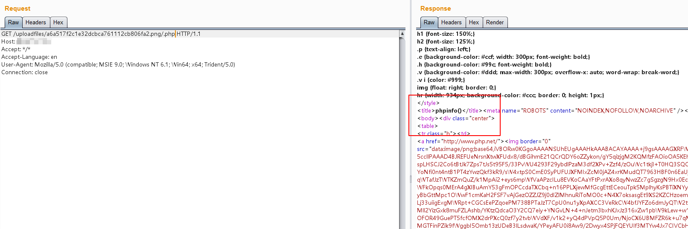

# Nginx 解析漏洞

Nginx是一款Web服务器，可以作为反向代理、负载均衡、邮件代理、HTTP缓存等。这个Vulhub环境包含一个由用户配置不当导致的解析漏洞。

版本信息：

- Nginx 1.x 最新版
- PHP 7.1.x 最新版

由此可知，该漏洞与Nginx、PHP版本无关，属于用户配置不当造成的解析漏洞。

该漏洞存在的原因是Nginx在配置中对文件扩展名的处理方式。当请求一个具有多个扩展名的文件（如`file.jpg.php`）时，Nginx可能会根据最后一个扩展名来处理，即使该文件最初是作为图片上传的。

这种配置错误通常出现在以下Nginx配置中：

```nginx
location ~ \.php$ {
    fastcgi_pass   127.0.0.1:9000;
    fastcgi_index  index.php;
    fastcgi_param  SCRIPT_FILENAME  /var/www/html$fastcgi_script_name;
    include        fastcgi_params;
}
```

当请求`file.jpg/.php`时，Nginx会将其作为PHP文件处理并发送给PHP-FPM解析，尽管它实际上是一个图片文件。这种行为可以被利用来执行作为图片文件上传的恶意代码。

## 环境搭建

直接执行如下命令启动一个包含解析漏洞的Nginx服务器：

```
docker compose up -d
```

运行成功后，Nginx将会监听80端口。

## 漏洞复现

访问`http://your-ip/uploadfiles/nginx.png`和`http://your-ip/uploadfiles/nginx.png/.php`即可查看效果。

正常显示：


增加`/.php`后缀，被解析成PHP文件：


访问`http://your-ip/index.php`可以测试上传功能，上传代码不存在漏洞，但利用解析漏洞即可getshell：




为防止此漏洞：

1. 正确配置Nginx的文件扩展名处理
2. 实施严格的文件类型验证
3. 将上传的文件存储在Web根目录之外
4. 使用随机文件名存储上传的文件
5. 实施适当的访问控制
