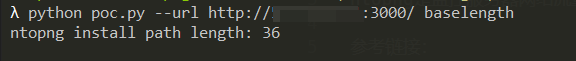
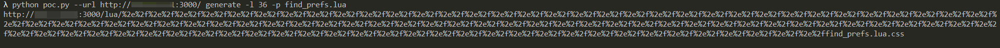
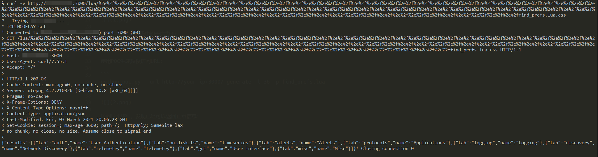

# ntopng 权限绕过漏洞（CVE-2021-28073）

ntopng 是监控服务器网络流量的工具，对外提供 Web 页面。其 4.2 及以前的版本中存在一处权限绕过漏洞，利用该漏洞可以未授权访问目标任意接口。

参考链接：

- http://noahblog.360.cn/ntopng-multiple-vulnerabilities/

## 漏洞环境

执行如下命令启动 ntopng：

```
docker compose up -d
```

环境启动后，访问 `http://your-ip:3000` 将被跳转到登录页面，默认密码 admin/admin，首次登录将会重设密码。

## 漏洞复现

根据参考链接中的方法，编写一个简单的 [poc.py](poc.py)。首先，计算出 ntopng lua 目录的长度：

```
python poc.py --url http://your-ip:3000/ baselength
```



可见，Vulhub 靶场中的长度为 36。

然后，找到我们想要越权访问的页面或接口，比如 `/lua/find_prefs.lua`，正常访问时会 302 跳转到登录页面，无权限。

使用 POC 生成越权访问 URL：

```
python poc.py --url http://your-ip:3000/ generate -l 36 -p find_prefs.lua
```



访问这个 URL，发现可以越权返回正常信息：



后续更深入的利用方法，可以自行修改 poc.py 利用。
