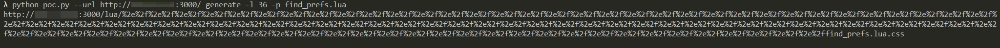

# ntopng权限绕过漏洞（CVE-2021-28073）

ntopng是监控服务器网络流量的工具，对外提供Web页面。其4.2及以前的版本中存在一处权限绕过漏洞，利用该漏洞可以未授权访问目标任意接口。

参考链接：

- http://noahblog.360.cn/ntopng-multiple-vulnerabilities/

## 漏洞环境

执行如下命令启动ntopng：

```
docker-compose up -d
```

环境启动后，访问`http://your-ip:3000`将被跳转到登录页面，默认密码admin/admin，首次登录将会重设密码。

## 漏洞复现

根据参考链接中的方法，编写一个简单的[poc.py](poc.py)。首先，计算出ntopng lua目录的长度：

```
python poc.py --url http://your-ip:3000/ baselength
```


可见，Vulhub靶场中的长度为36。

然后，找到我们想要越权访问的页面或接口，比如`/lua/find_prefs.lua`，正常访问时会302跳转到登录页面，无权限。

使用POC生成越权访问URL：

```
python poc.py --url http://your-ip:3000/ generate -l 36 -p find_prefs.lua
```



访问这个URL，发现可以越权返回正常信息：


后续更深入的利用方法，可以自行修改poc.py利用。
