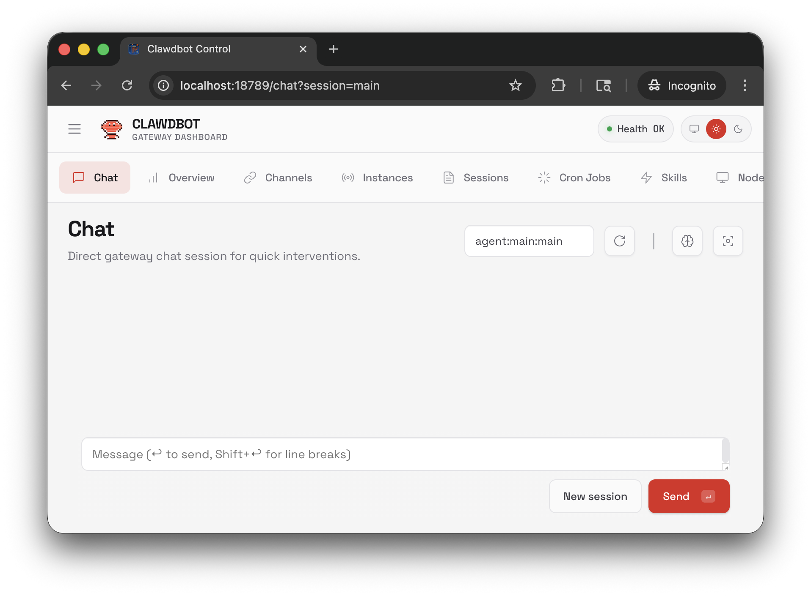
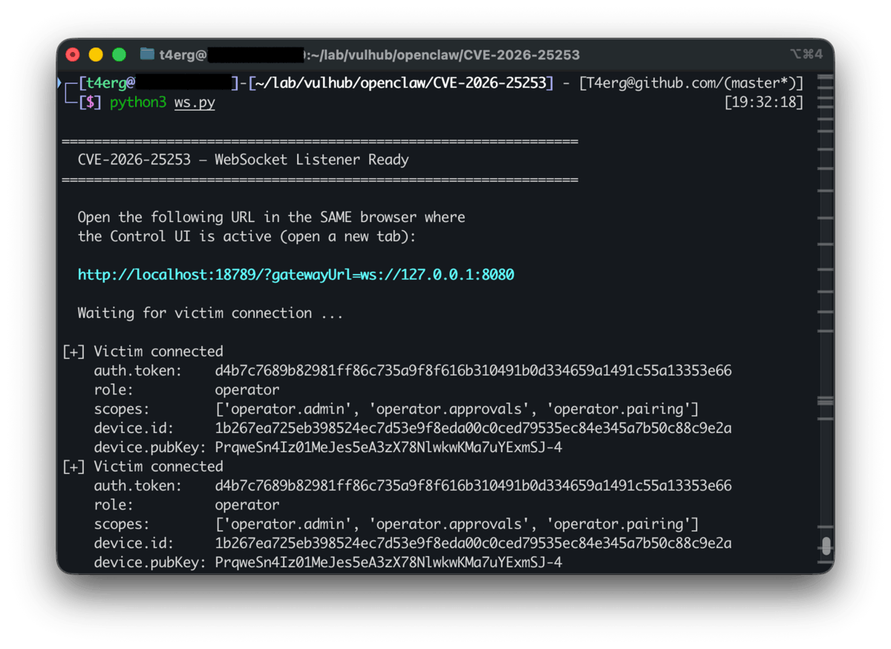

# OpenClaw 跨站WebSocket劫持漏洞（CVE-2026-25253）

[OpenClaw](https://github.com/openclaw/openclaw)（亦称clawdbot或Moltbot）是一款开源的多通道AI网关，运行在本地设备上，整合各种消息平台与AI模型。

CVE-2026-25253是OpenClaw Control UI中的跨站WebSocket劫持（CSWSH）漏洞（CVSS 8.8），影响clawdbot 2026.1.28及以下版本。Control UI接受URL查询参数`gatewayUrl`并在页面加载时自动发起WebSocket连接，缺少充分校验与明确确认。攻击者可构造恶意页面，诱导受害者浏览器连接到攻击者控制的WebSocket服务，从而泄露认证上下文（如`auth.token`、`device`、`role`、`scopes`）。攻击者基于泄露的认证信息可进一步劫持本地网关会话并执行任意命令。

参考链接：

- <https://nvd.nist.gov/vuln/detail/CVE-2026-25253>
- <https://github.com/openclaw/openclaw/security/advisories/GHSA-g8p2-7wf7-98mq>
- <https://security.snyk.io/vuln/SNYK-JS-OPENCLAW-15202445>
- <https://github.com/al4n4n/CVE-2026-25253-research>

## 环境搭建

执行如下命令启动OpenClaw 2026.1.28：

```
docker compose up -d
```

服务启动后，访问`http://your-ip:18789`进入Control UI。本地测试建议使用`http://localhost:18789`。

## 漏洞复现

在攻击者侧终端启动WebSocket监听服务并保持运行：

```bash
pip3 install websockets
python3 ws.py
```

监听服务绑定在`ws://127.0.0.1:8080`，等待受害者连接并将捕获到的认证字段打印至终端。

在浏览器中打开Control UI（`http://localhost:18789`）并保持连接正常，然后在同一浏览器会话中打开`exploit-min.html`，点击**Trigger**按钮。Control UI会变为离线状态（已被重定向连接到攻击者端点）。`ws.py`终端将打印捕获到的`connect`请求帧，其中包含`auth.token`、`role: "operator"`、`scopes`和`device`等字段，即表示认证上下文泄露复现成功。

下图展示了本地触发页面以及受害者Control UI在被重定向到攻击者`gatewayUrl`后变为离线状态：



下图展示了攻击者侧WebSocket监听日志，能够看到泄露的认证上下文（`auth.token`、`role`、`scopes`、`device`）：



捕获到的`connect`帧结构：

```json
{
  "type": "req",
  "method": "connect",
  "params": {
    "client": {"id": "clawdbot-control-ui", "mode": "webchat"},
    "role": "operator",
    "scopes": ["operator.admin", "operator.approvals", "operator.pairing"],
    "auth": {"token": "<泄露的token>"},
    "device": {"id": "<设备id>", "publicKey": "<公钥>", "signature": "<签名>", "signedAt": 0}
  }
}
```

基于窃取的凭据，攻击者可以`operator`角色认证网关、关闭代理沙箱并执行任意命令。完整的自动化RCE利用脚本可参考[al4n4n/CVE-2026-25253-research](https://github.com/al4n4n/CVE-2026-25253-research)。
